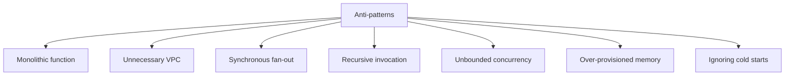
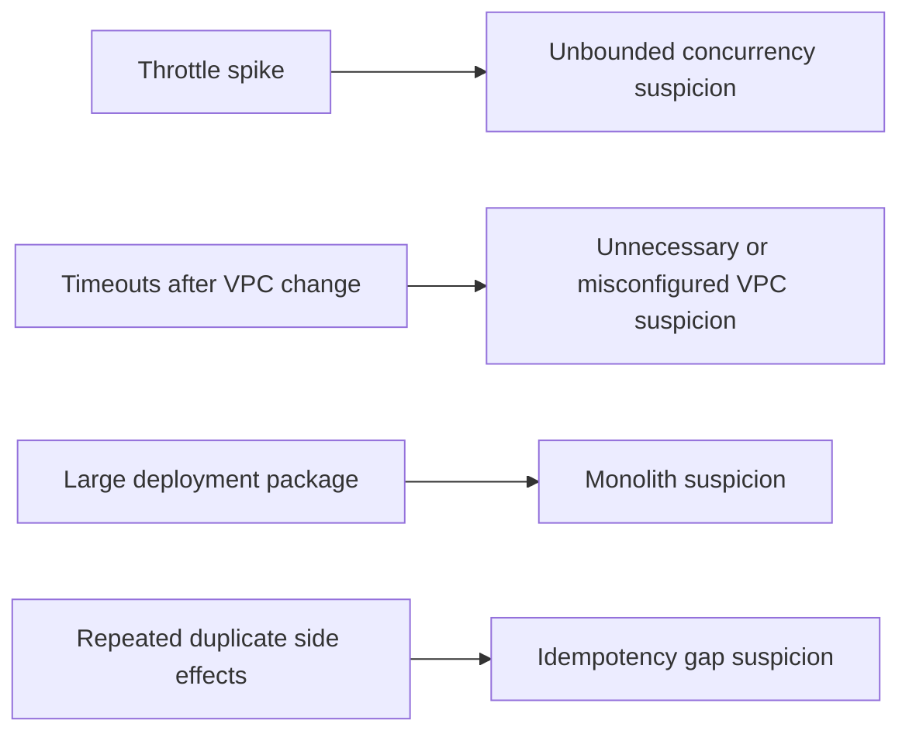

# Common Anti-Patterns

Many Lambda outages and cost surprises come from repeating a small set of architectural mistakes.

This page highlights the most common anti-patterns and the safer pattern that should replace each one.

## Anti-Pattern Map

## Monolithic Functions

**Problem:** One large function handles unrelated routes, events, and business domains.

**Why it hurts:**

- Broader IAM permissions.
- Larger packages and slower startup.
- Harder rollout and rollback.
- Poor ownership boundaries.

**Prefer:** Smaller functions organized by event contract or bounded context.

## VPC When Unnecessary

**Problem:** Attaching every function to a VPC "for security."

**Why it hurts:**

- Added network complexity.
- More egress planning.
- Potentially slower startup.
- Higher operational cost.

**Prefer:** Default networking unless private resource access is required.

## Synchronous Fan-Out

**Problem:** One request path directly invokes multiple downstream tasks and waits for all of them.

**Why it hurts:**

- Higher tail latency.
- Caller-visible partial failures.
- More brittle dependency graph.

**Prefer:** EventBridge, SNS, or Step Functions depending on coordination needs.

## Recursive Invocation

**Problem:** A function triggers itself directly or indirectly without strong safeguards.

**Why it hurts:**

- Runaway cost.
- Rapid concurrency exhaustion.
- Hard-to-stop incident patterns.

**Prefer:** Explicit queues, state machines, or bounded retry workflows.

## Unbounded Concurrency

**Problem:** No concurrency guardrail in front of fragile downstream systems.

**Why it hurts:**

- Database overload.
- Connection storms.
- Regional concurrency starvation.

**Prefer:** Reserved concurrency, queue buffering, and downstream-aware limits.

## Over-Provisioned Memory

**Problem:** Setting large memory values permanently without measurement.

**Why it hurts:**

- Higher cost without confirmed latency benefit.
- Hidden inefficiencies remain untreated.

**Prefer:** Benchmark with realistic traffic and choose the measured sweet spot.

## Ignoring Cold Starts

**Problem:** Treating cold starts as random noise instead of modeling them.

**Why it hurts:**

- Missed latency SLOs.
- Surprising spikes after idle periods or bursts.
- Overreaction during incidents because startup cost was never measured.

**Prefer:** Reduce init work, right-size memory, avoid unnecessary VPC, and use provisioned concurrency or SnapStart selectively.

## Quick Replacement Table

| Anti-pattern | Safer pattern |
|---|---|
| Monolithic function | Small function by contract or domain |
| VPC everywhere | VPC only when private access is required |
| Synchronous fan-out | Event-driven fan-out or Step Functions |
| Recursive invoke loops | Queue or workflow with explicit limits |
| No concurrency cap | Reserved concurrency and buffering |
| Guess-based memory | Measured memory tuning |
| Cold-start denial | Startup-aware design |

## Incident Warning Signs

## Practical Rules

1. Keep the function boundary small and intentional.
2. Make concurrency a design input, not an afterthought.
3. Decouple fan-out with events where possible.
4. Measure memory and startup instead of arguing from intuition.
5. Assume retries and duplicates from day one.

## See Also

- [Best Practices Index](./index.md)
- [Networking](./networking.md)
- [Performance](./performance.md)
- [Reliability](./reliability.md)
- [Platform Event Sources](../platform/event-sources.md)

## Sources

- [Best practices for working with AWS Lambda functions](https://docs.aws.amazon.com/lambda/latest/dg/best-practices.html)
- [Configuring Lambda function concurrency](https://docs.aws.amazon.com/lambda/latest/dg/configuration-concurrency.html)
- [Giving Lambda functions access to resources in an Amazon VPC](https://docs.aws.amazon.com/lambda/latest/dg/configuration-vpc.html)
- [Understanding the Lambda execution environment lifecycle](https://docs.aws.amazon.com/lambda/latest/dg/lambda-runtime-environment.html)
