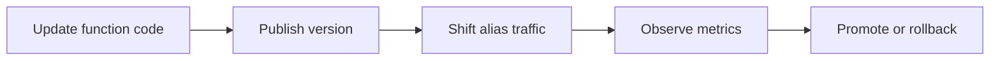
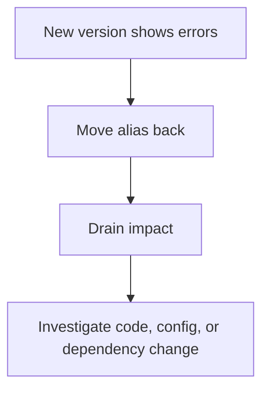

# Deployment Best Practices

Lambda deployment safety comes from immutability, traffic control, and rapid rollback.

The right unit of deployment is usually a published version behind an alias, not direct edits to `$LATEST` in production.

## Safe Deployment Model



## Use Versions and Aliases

Core rule:

- Publish a new immutable version for every release.
- Route production traffic through an alias such as `prod`.
- Roll back by repointing the alias, not by rebuilding old code under pressure.

## Blue/Green and Canary Patterns

| Pattern | How it works | Best use |
|---|---|---|
| Blue/green | Entire alias moves from old version to new version | Fast cutover with easy rollback |
| Canary | Small percentage of alias traffic goes to new version first | Risk-controlled release |
| Linear | Traffic increases in steps over time | Measured rollout for moderate-risk changes |

## CodeDeploy Integration

AWS CodeDeploy can manage gradual traffic shifting with automatic rollback based on alarms.

Use it when:

- You need a controlled release process across many functions.
- Alarms should automatically stop or revert a rollout.
- Manual alias editing is too error-prone for the environment.

## SAM and CDK

Infrastructure as code should own the deployment path.

Use:

- **AWS SAM** for concise serverless templates and deployment helpers.
- **AWS CDK** for higher-level infrastructure modeling and shared constructs.

## Example Alias Update

```bash
aws lambda update-alias \
    --function-name "$FUNCTION_NAME" \
    --name "$ALIAS_NAME" \
    --function-version 12
```

## Weighted Routing Example

```bash
aws lambda update-alias \
    --function-name "$FUNCTION_NAME" \
    --name "$ALIAS_NAME" \
    --function-version 12 \
    --routing-config AdditionalVersionWeights={11=0.1}
```

## Pre-Deployment Checks

- Validate package or container image integrity.
- Confirm execution role and environment variables are correct.
- Confirm event source mappings target the intended alias or version.
- Confirm alarms and dashboards exist before rollout.

## Rollback Strategy



Rollback should be:

- Fast.
- Alias-based.
- Practiced before a real incident.

## Practical Rules

1. Never treat `$LATEST` as the production release artifact.
2. Keep version numbers and source revisions traceable.
3. Shift traffic gradually for risky changes.
4. Use CloudWatch alarms as deployment gates.
5. Manage rollout through IaC, not ad hoc console edits.

## See Also

- [Platform Resource Relationships](../platform/resource-relationships.md)
- [Production Baseline](./production-baseline.md)
- [Performance](./performance.md)
- [Security](./security.md)
- [Home](../index.md)

## Sources

- [Managing Lambda function versions](https://docs.aws.amazon.com/lambda/latest/dg/configuration-versions.html)
- [Lambda aliases](https://docs.aws.amazon.com/lambda/latest/dg/configuration-aliases.html)
- [Deploying serverless applications gradually with AWS SAM](https://docs.aws.amazon.com/serverless-application-model/latest/developerguide/serverless-deploying.html)
- [Deploy Lambda applications with CodeDeploy](https://docs.aws.amazon.com/codedeploy/latest/userguide/deployment-groups-create-lambda.html)
- [AWS CDK Developer Guide](https://docs.aws.amazon.com/cdk/v2/guide/home.html)
