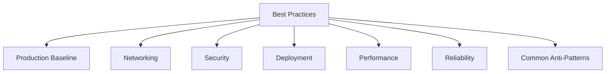
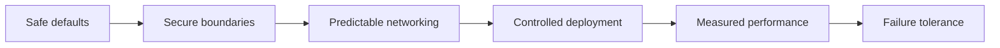

# Best Practices Index

The best practices section turns Lambda platform behavior into concrete production decisions.

Use these pages after you understand the platform model and before you standardize deployment patterns for a team or service.

## Scope of This Section

## Page Guide

| Page | Main question |
|---|---|
| [Production Baseline](./production-baseline.md) | What minimum settings should every serious function have? |
| [Networking](./networking.md) | When should a function be VPC-connected and how should egress work? |
| [Security](./security.md) | How do you enforce least privilege and protect secrets and code? |
| [Deployment](./deployment.md) | How do you release safely with versions, aliases, and gradual rollout? |
| [Performance](./performance.md) | How do you reduce cold starts and tune runtime efficiency? |
| [Reliability](./reliability.md) | How do you handle retries, duplicates, and downstream failure safely? |
| [Common Anti-Patterns](./common-anti-patterns.md) | Which designs repeatedly create cost, latency, or outage risk? |

## Recommended Read Order

1. [Production Baseline](./production-baseline.md)
2. [Security](./security.md)
3. [Networking](./networking.md)
4. [Deployment](./deployment.md)
5. [Performance](./performance.md)
6. [Reliability](./reliability.md)
7. [Common Anti-Patterns](./common-anti-patterns.md)

## Production Readiness Lens

## What This Section Assumes

These pages assume you already know:

- What a function, version, alias, and event source mapping are.
- The difference between sync, async, and poll-based invocation.
- Why cold starts and concurrency matter.

If not, go back to [Platform Index](../platform/index.md) first.

## Common Goals This Section Supports

- Standardizing a production baseline across many functions.
- Protecting databases and APIs from burst concurrency.
- Enforcing deployment controls and rollback safety.
- Lowering latency without overpaying blindly.
- Making retry and duplicate handling explicit.

## Which Page to Open First

| Situation | Start with |
|---|---|
| New function going to production | [Production Baseline](./production-baseline.md) |
| Private database connectivity decision | [Networking](./networking.md) |
| IAM or secret handling review | [Security](./security.md) |
| Release strategy design | [Deployment](./deployment.md) |
| Latency or cold-start concerns | [Performance](./performance.md) |
| Duplicate events or poison messages | [Reliability](./reliability.md) |
| Architecture smells in an existing system | [Common Anti-Patterns](./common-anti-patterns.md) |

## Design Principle

The best Lambda architecture is usually the simplest one that still makes scaling, failure, and security behavior explicit.

## Team Standardization Pattern

Many teams benefit from turning this section into an internal checklist for pull requests and architecture reviews.

A lightweight review template can ask:

- Is concurrency bounded intentionally?
- Is the deployment path alias-based?
- Is the function in a VPC only if required?
- Are retries and duplicate effects designed explicitly?
- Are secrets, logs, and invoke permissions reviewed?

## See Also

- [Platform Index](../platform/index.md)
- [Start Here: Overview](../start-here/overview.md)
- [Home](../index.md)
- [Start Here: Learning Paths](../start-here/learning-paths.md)

## Sources

- [Best practices for working with AWS Lambda functions](https://docs.aws.amazon.com/lambda/latest/dg/best-practices.html)
- [AWS Lambda Developer Guide](https://docs.aws.amazon.com/lambda/latest/dg/welcome.html)
- [Configuring Lambda function concurrency](https://docs.aws.amazon.com/lambda/latest/dg/configuration-concurrency.html)
- [Securing Lambda environment variables](https://docs.aws.amazon.com/lambda/latest/dg/configuration-envvars-encryption.html)
