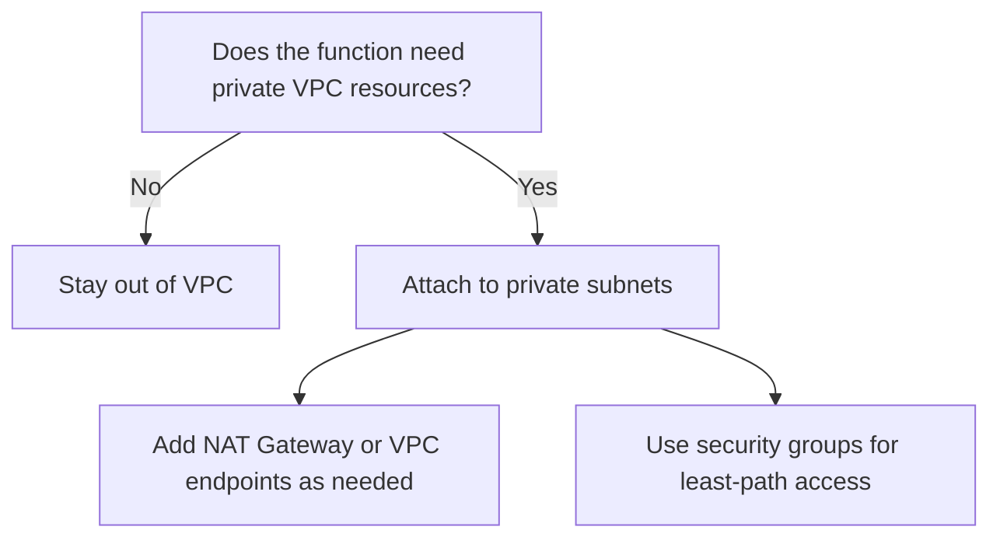
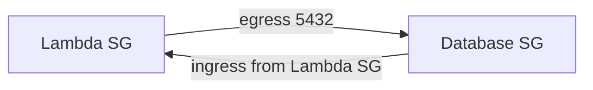

# Networking Best Practices

Networking choices in Lambda are architectural decisions, not cosmetic settings.

The most important decision is whether the function should stay on default Lambda networking or attach to your VPC.

## Decision Model



## Prefer Non-VPC by Default

Stay out of a VPC when the function only needs:

- Public AWS service endpoints.
- Public HTTPS APIs.
- API Gateway or EventBridge integration.

This keeps startup simpler and avoids unnecessary subnet, ENI, and egress design overhead.

## Use VPC Attachment Only for Real Need

Attach the function to a VPC when it must reach:

- Private RDS or Aurora instances.
- ElastiCache clusters.
- Internal load balancers or private services.
- Resources reachable only through private IP space.

## Subnet Design

| Recommendation | Why |
|---|---|
| Use private subnets across at least two Availability Zones | Resilience and consistent routing |
| Keep sufficient IP space | Attached services and scaling require address capacity |
| Avoid public subnets for Lambda attachment | Public subnet does not give direct internet egress |

## Internet Egress Pattern

For VPC-connected functions that must call public endpoints:

1. Place function ENIs in private subnets.
2. Route outbound traffic through a NAT Gateway.
3. Prefer VPC endpoints for AWS services where possible.

## VPC Endpoints First for AWS Services

Use gateway or interface endpoints when the traffic target is an AWS service with endpoint support.

Benefits include:

- Lower NAT dependency.
- Tighter network path control.
- Better cost posture for AWS-internal traffic patterns.

## Security Group Pattern



Prefer security-group-to-security-group rules over broad CIDR rules when possible.

## Cost Awareness

Networking cost often surprises Lambda teams.

Watch for:

- NAT Gateway hourly and data processing charges.
- Cross-AZ data transfer patterns.
- Overbuilt endpoint fleets for small workloads.

## Troubleshooting-Driven Rules

- If outbound calls started timing out after VPC attachment, inspect route tables first.
- If private database access fails, inspect security groups before touching code.
- If only AWS service access is needed, ask whether a VPC endpoint removes NAT dependency.

## Example VPC Update

```bash
aws lambda update-function-configuration \
    --function-name "$FUNCTION_NAME" \
    --vpc-config SubnetIds="subnet-aaaaaaaa,subnet-bbbbbbbb",SecurityGroupIds="sg-xxxxxxxxxxxxxxxxx"
```

## Practical Rules

1. Default to non-VPC.
2. Use private subnets for VPC-connected Lambda.
3. Use NAT only when public internet egress is truly required.
4. Use VPC endpoints for AWS services where practical.
5. Keep security groups narrow and explainable.

## See Also

- [Platform Networking](../platform/networking.md)
- [Security](./security.md)
- [Performance](./performance.md)
- [Reliability](./reliability.md)
- [Home](../index.md)

## Sources

- [Giving Lambda functions access to resources in an Amazon VPC](https://docs.aws.amazon.com/lambda/latest/dg/configuration-vpc.html)
- [Internet access for VPC-connected Lambda functions](https://docs.aws.amazon.com/lambda/latest/dg/configuration-vpc-internet.html)
- [Best practices for working with AWS Lambda functions](https://docs.aws.amazon.com/lambda/latest/dg/best-practices.html)
