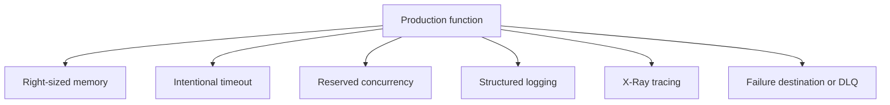

# Production Baseline

A Lambda function is not production ready just because it runs correctly once.

Every production function should start from a minimum baseline for memory, timeout, concurrency, logging, tracing, and failure handling.

## Baseline Components



## Recommended Minimums

| Control | Baseline guidance | Why |
|---|---|---|
| Memory | Start above absolute minimum and measure | More memory also increases CPU allocation |
| Timeout | Set from workload SLO and downstream latency budget | Default values are rarely correct |
| Reserved concurrency | Set for critical functions | Protects both the function and neighbors |
| Logging | Emit structured JSON logs | Easier search and correlation |
| Tracing | Enable active tracing where distributed visibility matters | Speeds root cause analysis |
| Failure handling | Configure async destination or DLQ where supported | Prevents silent event loss |

## Memory and Timeout

Do not set these blindly.

Rules:

- Memory affects both available RAM and CPU share.
- Timeout should be shorter than the time at which the caller or queue semantics become unsafe.
- Functions that call downstream services need explicit headroom, not unlimited timeout.

## Reserved Concurrency as a Guardrail

Reserved concurrency should be normal for important workloads.

It helps in two directions:

- Guarantees capacity for critical functions.
- Prevents one function from consuming all regional concurrency.

## Failure Routing

Choose a failure capture mechanism that matches the invocation type.

| Invocation type | Typical baseline |
|---|---|
| Asynchronous | On-failure destination or DLQ |
| SQS | Queue redrive policy and visibility timeout alignment |
| Streams | Retry strategy, maximum record age, bisect, alerting |

## Logging Baseline

Structured logs should include:

- Request or correlation identifier.
- Event type or route.
- Major business outcome.
- Error class and safe diagnostic details.
- Duration or key downstream timing where useful.

## Tracing Baseline

Enable X-Ray active tracing when:

- The function participates in end-to-end request paths.
- You need to understand downstream latency composition.
- Multiple functions or services contribute to the same transaction.

## Example Configuration Update

```bash
aws lambda update-function-configuration \
    --function-name "$FUNCTION_NAME" \
    --memory-size 1024 \
    --timeout 15 \
    --tracing-config Mode=Active

aws lambda put-function-concurrency \
    --function-name "$FUNCTION_NAME" \
    --reserved-concurrent-executions 25
```

## Baseline Checklist

- Memory reviewed with real measurements.
- Timeout explicitly justified.
- Reserved concurrency set or intentionally omitted with rationale.
- Logs are structured and searchable.
- Tracing enabled where latency attribution matters.
- Failure path captured and monitored.

## Common Baseline Gaps

- Timeout left at a default that does not match workload behavior.
- No reserved concurrency on a critical customer-facing function.
- Plaintext log strings that cannot be filtered reliably.
- Async sources configured without a clear failure destination.
- Memory minimized for cost and then repaid with longer duration.

!!! tip
    Standardize a baseline template for every new function so teams debate exceptions, not fundamentals.

## See Also

- [Best Practices Index](./index.md)
- [Performance](./performance.md)
- [Reliability](./reliability.md)
- [Concurrency and Scaling](../platform/concurrency-and-scaling.md)
- [Home](../index.md)

## Sources

- [Best practices for working with AWS Lambda functions](https://docs.aws.amazon.com/lambda/latest/dg/best-practices.html)
- [Configuring Lambda function options](https://docs.aws.amazon.com/lambda/latest/dg/configuration-function-common.html)
- [Configuring reserved concurrency for a function](https://docs.aws.amazon.com/lambda/latest/dg/configuration-concurrency.html)
- [Configuring dead-letter queues for Lambda functions](https://docs.aws.amazon.com/lambda/latest/dg/invocation-async-retain-records.html#invocation-dlq)
- [Using AWS X-Ray with Lambda](https://docs.aws.amazon.com/lambda/latest/dg/services-xray.html)
