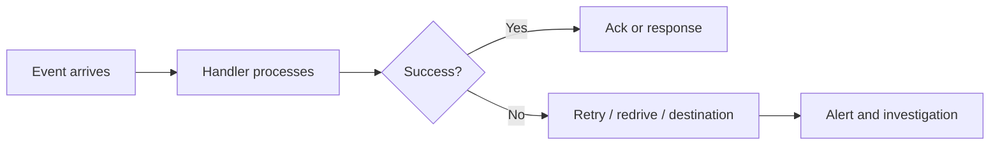

# Reliability Best Practices

Reliable Lambda systems are designed for retries, duplicates, partial failure, and downstream instability from the beginning.

Assume every event source will eventually deliver work at the wrong time or more than once.

## Reliability Model



## Retry Behavior Depends on Event Source

| Source type | Retry owner | Reliability concern |
|---|---|---|
| Synchronous | Caller | Caller may retry aggressively |
| Asynchronous | Lambda service | Duplicate delivery and destination configuration |
| SQS | Queue plus Lambda poller | Visibility timeout, poison messages, redrive |
| Streams | Lambda poller | Stalled shards and replay scope |

## Dead-Letter Queues and Destinations

Use failure capture intentionally.

- **DLQ** is useful for retaining failed async events in SQS or SNS.
- **On-failure destinations** provide richer routing for asynchronous invocation records.
- For SQS, the queue redrive policy is the usual poison-message control.

## Idempotency

Idempotency is mandatory whenever retries or duplicates are possible.

Strategies include:

- Event IDs stored in DynamoDB with TTL.
- Conditional writes.
- Natural business keys that make duplicate actions harmless.

## Circuit Breakers and Downstream Protection

If a downstream dependency is degraded, Lambda can amplify the problem through concurrency.

Protective patterns:

- Reserved concurrency caps.
- SQS buffering in front of fragile systems.
- Client-side timeout and backoff.
- Circuit breaker logic to stop repeated failing calls.

## Example Async Failure Destination

```bash
aws lambda put-function-event-invoke-config \
    --function-name "$FUNCTION_NAME" \
    --destination-config '{"OnFailure":{"Destination":"arn:aws:sqs:$REGION:<account-id>:failed-events"}}'
```

## Partial Batch Response

For supported poll-based sources, partial batch response can reduce unnecessary replay of already successful records.

Use it when batch reprocessing is expensive or risky.

## Reserved Concurrency as Reliability Control

Reserved concurrency is not just for performance.

It is also a reliability tool because it limits blast radius when:

- A buggy deployment loops on a hot path.
- A downstream database cannot handle unconstrained parallelism.
- Background jobs compete with customer-facing traffic.

## Reliability Checklist

- Retries understood for each event source.
- Duplicate-safe logic implemented.
- Failure destination or DLQ configured where appropriate.
- Timeouts aligned with queue and caller behavior.
- Concurrency bounded to match downstream capacity.

## See Also

- [Platform Event Sources](../platform/event-sources.md)
- [Platform Concurrency and Scaling](../platform/concurrency-and-scaling.md)
- [Production Baseline](./production-baseline.md)
- [Common Anti-Patterns](./common-anti-patterns.md)
- [Home](../index.md)

## Sources

- [Best practices for working with AWS Lambda functions](https://docs.aws.amazon.com/lambda/latest/dg/best-practices.html)
- [Capturing records of asynchronous invocations](https://docs.aws.amazon.com/lambda/latest/dg/invocation-async-retain-records.html)
- [Using Lambda with Amazon SQS](https://docs.aws.amazon.com/lambda/latest/dg/with-sqs.html)
- [Using Lambda with Amazon Kinesis](https://docs.aws.amazon.com/lambda/latest/dg/with-kinesis.html)
- [Using Lambda with DynamoDB](https://docs.aws.amazon.com/lambda/latest/dg/with-ddb.html)
