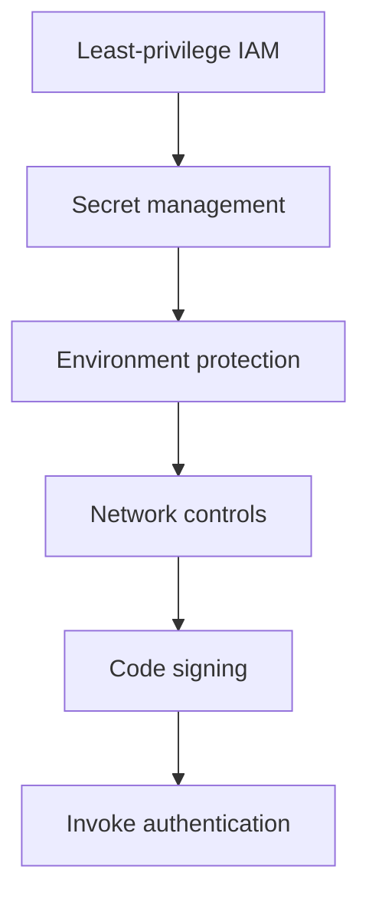

# Security Best Practices

Lambda security is strongest when identity, secret handling, network boundaries, and deployment integrity are all treated as production controls.

Do not reduce Lambda security to a single IAM policy review.

## Security Control Stack



## Least-Privilege Execution Roles

Every function should have an execution role scoped to the exact downstream resources it needs.

Avoid:

- Broad `*` resource permissions.
- Reusing one highly privileged role across many unrelated functions.
- Granting write access where read access is enough.

## Secrets Management

Prefer AWS Secrets Manager or Systems Manager Parameter Store for secrets.

Use environment variables for non-secret configuration and only limited secret references when the retrieval model is intentional.

Why:

- Secrets can be rotated.
- Access is auditable.
- Retrieval can be scoped with IAM.

## Environment Variable Encryption

Sensitive configuration should use KMS-backed protection and strict access to decrypt permissions.

That does not remove the need for secret management; it complements it.

## Code Signing

Require code signing when artifact trust matters.

Best fit scenarios:

- Central platform teams managing deployment guardrails.
- Regulated workloads.
- Multiple CI systems or publisher identities.

## Function URL Authentication Choices

| Auth type | Recommended use |
|---|---|
| `AWS_IAM` | Internal or controlled callers using SigV4 |
| `NONE` | Rare public use cases with explicit risk acceptance and compensating controls |

## Logging and Data Exposure

Security-sensitive logs should:

- Avoid writing secrets or access tokens.
- Include enough context for audit and incident response.
- Mask customer data where appropriate.

## Example: Code Signing Configuration

```bash
aws lambda update-function-code-signing-config \
    --code-signing-config-arn arn:aws:lambda:$REGION:<account-id>:code-signing-config:csc-xxxxxxxxxxxxxxxxx \
    --function-name "$FUNCTION_NAME"
```

## Operational Rules

1. Separate execution roles by workload or trust boundary.
2. Keep invoke permissions narrow with specific principals and source ARNs.
3. Fetch secrets from managed services instead of embedding them in packages.
4. Require code signing for high-trust environments.
5. Default function URLs to `AWS_IAM` unless public access is intentionally required.

## Security Review Checklist

- Execution role scoped to exact resources.
- Resource-based policy restricted to intended principals.
- Secrets stored outside source and deployment artifacts.
- KMS permissions reviewed.
- Function URL auth mode justified.
- Logging reviewed for data leakage.

## See Also

- [Platform Security Model](../platform/security-model.md)
- [Networking Best Practices](./networking.md)
- [Deployment](./deployment.md)
- [Reliability](./reliability.md)
- [Home](../index.md)

## Sources

- [Managing permissions in AWS Lambda](https://docs.aws.amazon.com/lambda/latest/dg/lambda-permissions.html)
- [Execution role for Lambda](https://docs.aws.amazon.com/lambda/latest/dg/lambda-intro-execution-role.html)
- [Securing Lambda environment variables](https://docs.aws.amazon.com/lambda/latest/dg/configuration-envvars-encryption.html)
- [Using AWS Secrets Manager secrets in Lambda functions](https://docs.aws.amazon.com/lambda/latest/dg/with-secrets-manager.html)
- [Configuring code signing for Lambda](https://docs.aws.amazon.com/lambda/latest/dg/configuration-codesigning.html)
- [Lambda function URLs](https://docs.aws.amazon.com/lambda/latest/dg/urls-auth.html)
