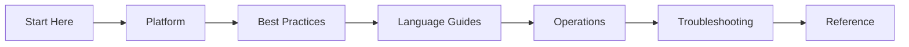

# AWS Lambda Practical Guide

Comprehensive, practical documentation for building, deploying, operating, and troubleshooting serverless applications on AWS Lambda.

This site is organized as a learning and operations guide so you can move from fundamentals to production troubleshooting with clear, repeatable workflows.

-   :material-rocket-launch:{ .lg .middle } **New to Lambda?**

    ---

    Start with serverless fundamentals and deploy your first function in under 15 minutes.

    [:octicons-arrow-right-24: Start Here](start-here/overview.md)

-   :material-server:{ .lg .middle } **Running Production Functions?**

    ---

    Apply battle-tested patterns for security, performance, deployment, and reliability.

    [:octicons-arrow-right-24: Best Practices](best-practices/index.md)

-   :material-fire:{ .lg .middle } **Something Broke?**

    ---

    Follow symptom-driven playbooks and CloudWatch Logs Insights queries to diagnose and resolve production issues.

    [:octicons-arrow-right-24: Troubleshooting](troubleshooting/index.md)

## Navigate the Guide

| Section | Purpose |
|---|---|
| [Start Here](start-here/overview.md) | Orientation, learning paths, and repository map. |
| [Platform](platform/index.md) | Understand Lambda execution model, event sources, concurrency, and networking. |
| [Best Practices](best-practices/index.md) | Apply production patterns for security, networking, deployment, performance, and reliability. |
| Language Guides | Runtime-specific implementation tracks for [Python](language-guides/python/index.md), [Node.js](language-guides/nodejs/index.md), [Java](language-guides/java/index.md), and [.NET](language-guides/dotnet/index.md). |
| [Operations](operations/index.md) | Run production workloads with deployment strategies, monitoring, and cost optimization. |
| [Troubleshooting](troubleshooting/index.md) | Symptom-driven diagnosis with playbooks, CloudWatch queries, and lab guides. |
| [Reference](reference/index.md) | Quick lookup for CLI commands, service limits, and environment variables. |

For orientation and study order, start with [Start Here](start-here/overview.md).

## Learning Flow

## Scope and Disclaimer

This is an independent community project. Not affiliated with or endorsed by Amazon Web Services.

Primary product reference: [AWS Lambda Developer Guide](https://docs.aws.amazon.com/lambda/latest/dg/welcome.html)

## See Also

- [Overview](start-here/overview.md)
- [Learning Paths](start-here/learning-paths.md)
- [Repository Map](start-here/repository-map.md)

## Sources

- [AWS Lambda Developer Guide](https://docs.aws.amazon.com/lambda/latest/dg/welcome.html)
- [AWS Lambda API Reference](https://docs.aws.amazon.com/lambda/latest/api/welcome.html)
- [AWS Lambda Operator Guide](https://docs.aws.amazon.com/lambda/latest/operatorguide/intro.html)
