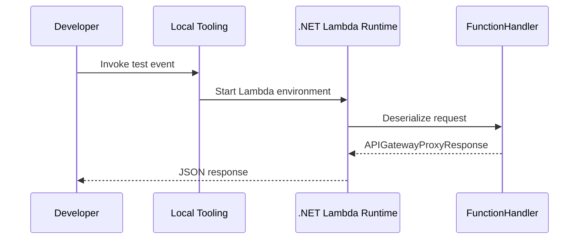

# Run a .NET Lambda Function Locally

This tutorial shows two supported local workflows for .NET 8 Lambda functions: the AWS .NET Mock Lambda Test Tool and AWS SAM CLI.

## Prerequisites

- .NET 8 SDK installed.
- AWS SAM CLI installed.
- Docker running for SAM local emulation.
- `Amazon.Lambda.Tools` installed globally.

```bash
dotnet tool install --global Amazon.Lambda.Tools
dotnet tool update --global Amazon.Lambda.TestTool-8.0
```

## What You'll Build

You will create a minimal API Gateway handler and invoke it locally with both tools.

```text
src/GuideApi/
├── Function.cs
├── GuideApi.csproj
├── aws-lambda-tools-defaults.json
└── template.yaml
```

## Create the Project

```bash
dotnet new lambda.EmptyFunction --name GuideApi --framework net8.0
```

Update the function to use API Gateway request and response types.

```csharp
using Amazon.Lambda.APIGatewayEvents;
using Amazon.Lambda.Core;

[assembly: LambdaSerializer(typeof(Amazon.Lambda.Serialization.SystemTextJson.DefaultLambdaJsonSerializer))]

namespace GuideApi;

public class Function
{
    public APIGatewayProxyResponse FunctionHandler(APIGatewayProxyRequest request, ILambdaContext context)
    {
        context.Logger.LogInformation($"Path={request.Path} Method={request.HttpMethod}");

        return new APIGatewayProxyResponse
        {
            StatusCode = 200,
            Headers = new Dictionary<string, string> { ["Content-Type"] = "application/json" },
            Body = "{\"message\":\"local .NET Lambda ok\"}"
        };
    }
}
```

## Add Package References

```xml
<ItemGroup>
  <PackageReference Include="Amazon.Lambda.APIGatewayEvents" Version="2.*" />
  <PackageReference Include="Amazon.Lambda.Core" Version="2.*" />
  <PackageReference Include="Amazon.Lambda.Serialization.SystemTextJson" Version="2.*" />
</ItemGroup>
```

## Run with the .NET Mock Lambda Test Tool

Build first so the tool can load the assembly.

```bash
dotnet build src/GuideApi/GuideApi.csproj
dotnet lambda-test-tool-8.0 --project-location "src/GuideApi"
```

Use a test event such as:

```json
{
  "httpMethod": "GET",
  "path": "/health",
  "headers": {
    "host": "localhost"
  }
}
```

## Run with SAM CLI

Create a minimal SAM template.

```yaml
Resources:
  DotnetLocalFunction:
    Type: AWS::Serverless::Function
    Properties:
      Runtime: dotnet8
      Handler: GuideApi::GuideApi.Function::FunctionHandler
      CodeUri: src/GuideApi/
      MemorySize: 512
      Timeout: 10
      Events:
        Api:
          Type: Api
          Properties:
            Path: /health
            Method: get
```

Start the local API endpoint.

```bash
sam build --template-file template.yaml
sam local start-api --template-file .aws-sam/build/template.yaml
curl --silent "http://127.0.0.1:3000/health"
```



## Local Testing Tips

- Use the Mock Lambda Test Tool for fast handler iteration.
- Use SAM when you need API Gateway routing, environment variables, or event-source emulation.
- Keep `aws-lambda-tools-defaults.json` aligned with your deployment defaults.
- Validate JSON contract compatibility before deploying.

!!! note
    SAM local behavior is close to Lambda, but not identical. Validate IAM permissions, networking, and service integrations in AWS before promoting changes.

## Verification

Run the following checks:

```bash
dotnet restore src/GuideApi/GuideApi.csproj
dotnet build src/GuideApi/GuideApi.csproj
sam build --template-file template.yaml
sam local invoke DotnetLocalFunction --event events/apigateway.json --template-file .aws-sam/build/template.yaml
```

Expected results:

- The project restores and builds cleanly.
- The handler loads without serialization errors.
- The response returns HTTP status `200` and a JSON body.

## See Also

- [First Deploy](./02-first-deploy.md)
- [Configuration](./03-configuration.md)
- [.NET Runtime Reference](./dotnet-runtime.md)

## Sources

- [Develop .NET Lambda functions with .NET CLI](https://docs.aws.amazon.com/lambda/latest/dg/csharp-package-cli.html)
- [Testing serverless applications locally with AWS SAM CLI](https://docs.aws.amazon.com/serverless-application-model/latest/developerguide/using-sam-cli-local-testing.html)
