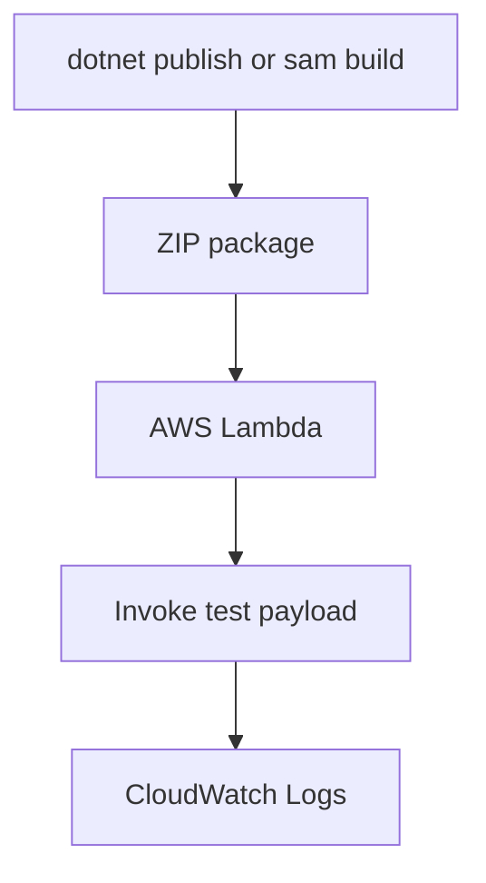

# Deploy Your First .NET Lambda Function

This tutorial deploys a .NET 8 Lambda function with either AWS SAM or `dotnet lambda deploy-function`.

## Deployment Choices

- Use `sam deploy` when you want repeatable infrastructure and API event wiring.
- Use `dotnet lambda deploy-function` when you want the fastest first deployment from a single project.

## Sample Handler

```csharp
using Amazon.Lambda.Core;

[assembly: LambdaSerializer(typeof(Amazon.Lambda.Serialization.SystemTextJson.DefaultLambdaJsonSerializer))]

namespace GuideApi;

public class Function
{
    public string FunctionHandler(string input, ILambdaContext context)
    {
        context.Logger.LogInformation("First deploy invoked");
        return $"Hello {input} from .NET 8";
    }
}
```

## Project Defaults

Store deployment defaults for the CLI workflow.

```json
{
  "Information": [
    "Default values for the Lambda .NET CLI.",
    "Use long flags for overrides in automation."
  ],
  "profile": "default",
  "region": "ap-northeast-2",
  "configuration": "Release",
  "function-runtime": "dotnet8",
  "function-memory-size": 512,
  "function-timeout": 10,
  "function-handler": "GuideApi::GuideApi.Function::FunctionHandler"
}
```

## Deploy with Amazon.Lambda.Tools

```bash
dotnet restore src/GuideApi/GuideApi.csproj
dotnet build src/GuideApi/GuideApi.csproj --configuration Release
dotnet lambda deploy-function "$FUNCTION_NAME" \
  --project-location "src/GuideApi" \
  --function-role "$ROLE_ARN" \
  --region "$REGION" \
  --function-runtime dotnet8 \
  --function-architecture arm64 \
  --function-memory-size 512 \
  --function-timeout 10
```

## Deploy with AWS SAM

Use SAM when you also want IAM policies, API Gateway, outputs, and stack lifecycle management.

```yaml
Transform: AWS::Serverless-2016-10-31
Resources:
  DotnetGuideFunction:
    Type: AWS::Serverless::Function
    Properties:
      FunctionName: !Ref AWS::StackName
      Runtime: dotnet8
      Handler: GuideApi::GuideApi.Function::FunctionHandler
      CodeUri: src/GuideApi/
      MemorySize: 512
      Timeout: 10
      Architectures:
        - arm64
      Policies:
        - AWSLambdaBasicExecutionRole
```

```bash
sam build --template-file template.yaml
sam deploy \
  --template-file .aws-sam/build/template.yaml \
  --stack-name "$FUNCTION_NAME" \
  --capabilities CAPABILITY_IAM \
  --region "$REGION" \
  --resolve-s3 \
  --confirm-changeset
```

## Invoke and Verify

```bash
aws lambda invoke \
  --function-name "$FUNCTION_NAME" \
  --payload '"Guide"' \
  --cli-binary-format raw-in-base64-out \
  response.json

aws lambda get-function \
  --function-name "$FUNCTION_NAME" \
  --region "$REGION"
```

Expected function ARN format:

```text
arn:aws:lambda:$REGION:<account-id>:function:$FUNCTION_NAME
```



## Promotion Guidance

- Keep the handler string stable after first deploy.
- Prefer `arm64` unless you have native dependencies that require `x86_64`.
- Tag the function or CloudFormation stack early for ownership and environment tracking.
- Move quickly from CLI-only deployment to SAM or CDK for team workflows.

## See Also

- [Run a .NET Lambda Function Locally](./01-local-run.md)
- [Configuration](./03-configuration.md)
- [Infrastructure as Code](./05-infrastructure-as-code.md)

## Sources

- [Deploy .NET Lambda functions with .NET CLI](https://docs.aws.amazon.com/lambda/latest/dg/csharp-package-cli.html)
- [Deploying serverless applications with AWS SAM](https://docs.aws.amazon.com/serverless-application-model/latest/developerguide/deploying-using-sam-cli.html)
