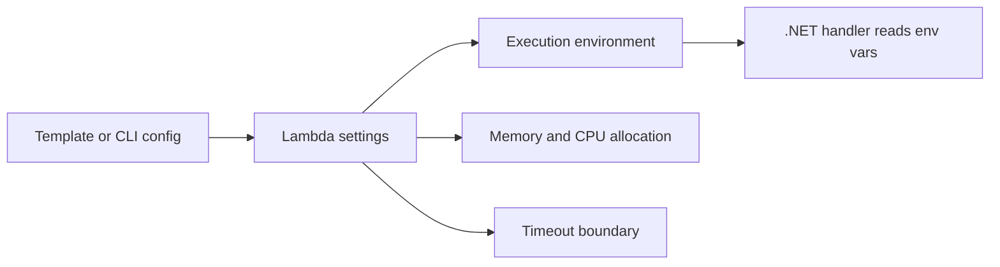

# Configure a .NET Lambda Function

This tutorial covers the operational settings you will tune most often for .NET Lambda workloads: environment variables, memory, timeout, and architecture.

## Baseline Configuration Areas

- Application settings via environment variables.
- Performance and cost via memory size.
- Failure boundaries via timeout.
- CPU and package compatibility via architecture.

## Read Configuration in Code

```csharp
using Amazon.Lambda.Core;

namespace GuideApi;

public class Function
{
    public string FunctionHandler(string input, ILambdaContext context)
    {
        var stage = Environment.GetEnvironmentVariable("STAGE") ?? "dev";
        var serviceName = Environment.GetEnvironmentVariable("POWERTOOLS_SERVICE_NAME") ?? "guide-api";

        context.Logger.LogInformation($"Stage={stage} Service={serviceName}");
        return $"{serviceName}:{stage}:{input}";
    }
}
```

## Environment Variables with SAM

```yaml
Resources:
  DotnetGuideFunction:
    Type: AWS::Serverless::Function
    Properties:
      Runtime: dotnet8
      Handler: GuideApi::GuideApi.Function::FunctionHandler
      CodeUri: src/GuideApi/
      Environment:
        Variables:
          STAGE: prod
          POWERTOOLS_SERVICE_NAME: guide-api
          LOG_LEVEL: Information
```

## Update Configuration with AWS CLI

```bash
aws lambda update-function-configuration \
  --function-name "$FUNCTION_NAME" \
  --region "$REGION" \
  --memory-size 1024 \
  --timeout 15 \
  --environment "Variables={STAGE=prod,POWERTOOLS_SERVICE_NAME=guide-api,LOG_LEVEL=Information}"
```

## Architecture Selection

`arm64` is usually the default choice for lower cost and good performance. Keep `x86_64` for compatibility if you depend on native libraries that are not available for Arm.

```bash
aws lambda update-function-configuration \
  --function-name "$FUNCTION_NAME" \
  --region "$REGION" \
  --architectures arm64
```

## Recommended Starting Points

| Workload | Memory | Timeout | Architecture |
|---|---:|---:|---|
| Lightweight API | 512 MB | 10 sec | arm64 |
| JSON transform / ETL | 1024 MB | 30 sec | arm64 |
| Native dependency workload | 1024 MB | 30 sec | x86_64 if required |
| VPC + database access | 1024 MB | 15 sec | arm64 |

## Configuration via .csproj and Tooling

Keep runtime-compatible publish settings in the project file.

```xml
<PropertyGroup>
  <TargetFramework>net8.0</TargetFramework>
  <PublishReadyToRun>true</PublishReadyToRun>
  <CopyLocalLockFileAssemblies>true</CopyLocalLockFileAssemblies>
  <GenerateRuntimeConfigurationFiles>true</GenerateRuntimeConfigurationFiles>
</PropertyGroup>
```

Use `aws-lambda-tools-defaults.json` for developer defaults, but keep production configuration in infrastructure templates.



## Operational Notes

- Memory also affects CPU allocation, so performance tuning is not only about RAM.
- Timeout should reflect realistic downstream latency, not best-case execution time.
- Environment variables are version-specific when you publish versions.
- Store secrets in Secrets Manager or Systems Manager Parameter Store, not in plaintext environment variables.

!!! warning
    If you change architecture after adding native dependencies, rebuild and test the package before updating production aliases.

## Verification

```bash
aws lambda get-function-configuration \
  --function-name "$FUNCTION_NAME" \
  --region "$REGION"

aws lambda invoke \
  --function-name "$FUNCTION_NAME" \
  --payload '"config-check"' \
  --cli-binary-format raw-in-base64-out \
  config-response.json
```

Confirm that:

- Environment variables are present.
- Memory, timeout, and architecture match the intended values.
- The function still invokes successfully after the update.

## See Also

- [First Deploy](./02-first-deploy.md)
- [Logging and Monitoring](./04-logging-monitoring.md)
- [Secrets Manager Recipe](./recipes/secrets-manager.md)

## Sources

- [Configuring Lambda functions](https://docs.aws.amazon.com/lambda/latest/dg/configuration-function-common.html)
- [Lambda environment variables](https://docs.aws.amazon.com/lambda/latest/dg/configuration-envvars.html)
- [Selecting instruction set architecture for Lambda](https://docs.aws.amazon.com/lambda/latest/dg/foundation-arch.html)
