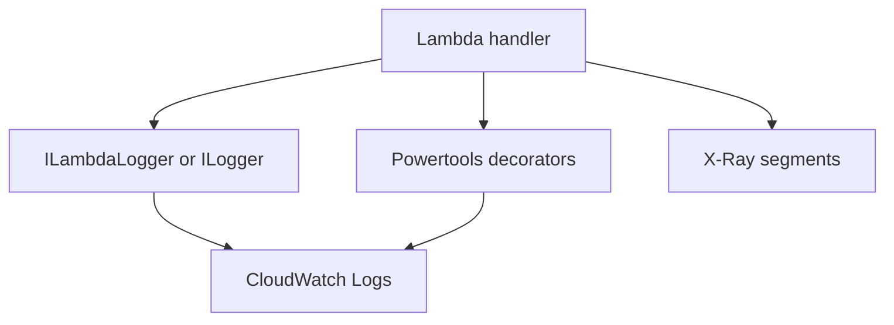

# Logging and Monitoring for .NET Lambda Functions

This tutorial shows practical observability patterns for .NET 8 Lambda functions with `ILambdaLogger`, `Microsoft.Extensions.Logging`, Powertools for AWS Lambda (.NET), and AWS X-Ray.

## Logging Layers

- `ILambdaLogger` is always available from `ILambdaContext`.
- `Microsoft.Extensions.Logging` is useful when you build dependency-injected handlers.
- Powertools adds structured logging, metrics, and tracing decorators.
- CloudWatch Logs and X-Ray provide service-side visibility.

## Basic Logging with ILambdaLogger

```csharp
using Amazon.Lambda.Core;

public class Function
{
    public string FunctionHandler(string input, ILambdaContext context)
    {
        context.Logger.LogInformation($"RequestId={context.AwsRequestId} Input={input}");
        return "ok";
    }
}
```

## Using Microsoft.Extensions.Logging

```csharp
using Microsoft.Extensions.DependencyInjection;
using Microsoft.Extensions.Logging;

var services = new ServiceCollection();
services.AddLogging(builder => builder.AddJsonConsole());

var provider = services.BuildServiceProvider();
var logger = provider.GetRequiredService<ILogger<Function>>();
logger.LogInformation("Structured startup complete");
```

## Powertools for Structured Logging and Tracing

```xml
<ItemGroup>
  <PackageReference Include="AWS.Lambda.Powertools.Logging" Version="1.*" />
  <PackageReference Include="AWS.Lambda.Powertools.Metrics" Version="1.*" />
  <PackageReference Include="AWS.Lambda.Powertools.Tracing" Version="1.*" />
</ItemGroup>
```

```csharp
using Amazon.Lambda.Core;
using AWS.Lambda.Powertools.Logging;
using AWS.Lambda.Powertools.Tracing;

public class Function
{
    [Logging(LogEvent = true, CorrelationIdPath = "/headers/x-correlation-id")]
    [Tracing(CaptureMode = TracingCaptureMode.ResponseAndError)]
    public string FunctionHandler(string input, ILambdaContext context)
    {
        Logger.AppendKey("request_id", context.AwsRequestId);
        Logger.LogInformation("Handling request in .NET 8 Lambda");
        return input.ToUpperInvariant();
    }
}
```

## Enable Active Tracing

```bash
aws lambda update-function-configuration \
  --function-name "$FUNCTION_NAME" \
  --region "$REGION" \
  --tracing-config Mode=Active
```

SAM example:

```yaml
Tracing: Active
Environment:
  Variables:
    POWERTOOLS_SERVICE_NAME: guide-api
    POWERTOOLS_LOG_LEVEL: Information
```

## CloudWatch Logs Insights Example

```sql
fields @timestamp, @message, @requestId
| filter @message like /RequestId=/
| sort @timestamp desc
| limit 20
```



## Practical Guidance

- Log request IDs, correlation IDs, and business identifiers.
- Avoid logging secrets, access tokens, or full payloads from untrusted clients.
- Use structured logs so CloudWatch Logs Insights queries remain stable.
- Use metrics for alarms and traces for dependency timing, not vice versa.

## Verification

```bash
aws logs describe-log-groups \
  --log-group-name-prefix "/aws/lambda/$FUNCTION_NAME" \
  --region "$REGION"

aws xray get-service-graph \
  --start-time 2026-04-07T00:00:00Z \
  --end-time 2026-04-07T01:00:00Z \
  --region "$REGION"
```

Confirm that:

- Log lines contain request correlation fields.
- X-Ray receives traces for sampled invocations.
- Error paths emit useful diagnostic details without exposing sensitive data.

## See Also

- [Configuration](./03-configuration.md)
- [CI/CD](./06-ci-cd.md)
- [Custom Metrics Recipe](./recipes/custom-metrics.md)

## Sources

- [Monitor Lambda functions with CloudWatch](https://docs.aws.amazon.com/lambda/latest/dg/monitoring-functions.html)
- [AWS X-Ray and Lambda](https://docs.aws.amazon.com/lambda/latest/dg/services-xray.html)
- [Powertools for AWS Lambda (.NET)](https://docs.aws.amazon.com/powertools/dotnet/latest/)
