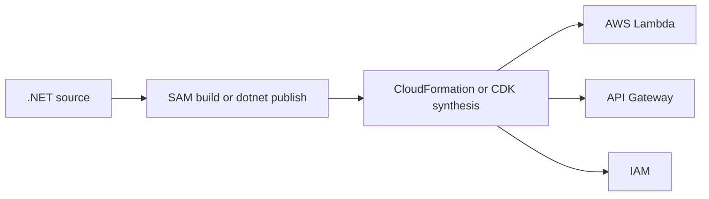

# Infrastructure as Code for .NET Lambda

This tutorial covers two practical infrastructure patterns for .NET Lambda teams: AWS SAM templates and AWS CDK with C#.

## Why Standardize on IaC

- Function configuration stays versioned with code.
- IAM permissions are reviewable and repeatable.
- API Gateway, alarms, layers, and outputs can be promoted across environments.

## SAM Template Baseline

```yaml
Transform: AWS::Serverless-2016-10-31
Resources:
  DotnetGuideFunction:
    Type: AWS::Serverless::Function
    Properties:
      Runtime: dotnet8
      Handler: GuideApi::GuideApi.Function::FunctionHandler
      CodeUri: src/GuideApi/
      MemorySize: 512
      Timeout: 10
      Architectures:
        - arm64
      Policies:
        - AWSLambdaBasicExecutionRole
      Events:
        Api:
          Type: Api
          Properties:
            Path: /hello
            Method: get
```

Deploy it with:

```bash
sam build --template-file template.yaml
sam deploy \
  --template-file .aws-sam/build/template.yaml \
  --stack-name "$FUNCTION_NAME" \
  --capabilities CAPABILITY_IAM \
  --region "$REGION" \
  --resolve-s3
```

## CDK with C# Baseline

Create a stack with Lambda and API Gateway resources.

```csharp
using Amazon.CDK;
using Amazon.CDK.AWS.Lambda;
using Amazon.CDK.AWS.APIGateway;

public class DotnetGuideStack : Stack
{
    public DotnetGuideStack(Construct scope, string id, IStackProps? props = null) : base(scope, id, props)
    {
        var fn = new Function(this, "GuideFunction", new FunctionProps
        {
            Runtime = Runtime.DOTNET_8,
            Handler = "GuideApi::GuideApi.Function::FunctionHandler",
            Code = Code.FromAsset("src/GuideApi/bin/Release/net8.0/publish"),
            Architecture = Architecture.ARM_64,
            MemorySize = 512,
            Timeout = Duration.Seconds(10)
        });

        _ = new LambdaRestApi(this, "GuideApi", new LambdaRestApiProps
        {
            Handler = fn,
            Proxy = true
        });
    }
}
```

## .csproj for CDK App

```xml
<ItemGroup>
  <PackageReference Include="Amazon.CDK.Lib" Version="2.*" />
  <PackageReference Include="Constructs" Version="10.*" />
</ItemGroup>
```

## When to Use Which

| Need | Prefer |
|---|---|
| Fast Lambda + API packaging | AWS SAM |
| Multi-stack application modeling in C# | AWS CDK |
| Team already using CloudFormation-native templates | AWS SAM |
| Reusable constructs and higher-level abstractions | AWS CDK |



## Operational Guidance

- Keep environment-specific values in parameters, context, or CI/CD variables.
- Prefer managed policies only for first iterations; tighten them quickly.
- Emit stack outputs for function names, API URLs, and log group names.
- Review generated CloudFormation before production rollouts.

## Verification

For SAM:

```bash
sam validate --template-file template.yaml
sam build --template-file template.yaml
```

For CDK:

```bash
dotnet build infra/GuideInfra/GuideInfra.csproj
cdk synth
```

## See Also

- [First Deploy](./02-first-deploy.md)
- [CI/CD](./06-ci-cd.md)
- [Docker Image Recipe](./recipes/docker-image.md)

## Sources

- [AWS SAM Developer Guide](https://docs.aws.amazon.com/serverless-application-model/latest/developerguide/what-is-sam.html)
- [AWS CDK Developer Guide](https://docs.aws.amazon.com/cdk/v2/guide/home.html)
- [Lambda .NET zip deployment packaging](https://docs.aws.amazon.com/lambda/latest/dg/csharp-package-cli.html)
