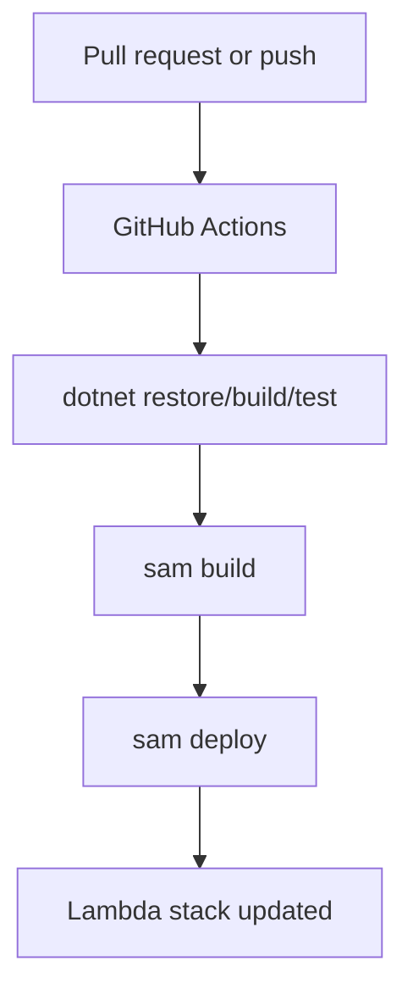

# CI/CD for .NET Lambda with GitHub Actions

This tutorial builds a simple pipeline that restores, tests, packages, and deploys a .NET 8 Lambda application with GitHub Actions and AWS SAM.

## Pipeline Goals

- Validate the .NET project on every pull request.
- Build the SAM application artifact consistently.
- Deploy from the default branch using OpenID Connect or stored AWS credentials.

## Recommended Workflow Stages

1. `dotnet restore`
2. `dotnet build`
3. `dotnet test`
4. `sam build`
5. `sam deploy`

## Example GitHub Actions Workflow

```yaml
name: dotnet-lambda-ci

on:
  pull_request:
  push:
    branches:
      - main

jobs:
  build-and-deploy:
    runs-on: ubuntu-latest
    permissions:
      id-token: write
      contents: read
    steps:
      - uses: actions/checkout@v4

      - uses: actions/setup-dotnet@v4
        with:
          dotnet-version: '8.0.x'

      - uses: aws-actions/setup-sam@v2

      - uses: aws-actions/configure-aws-credentials@v4
        with:
          role-to-assume: ${{ secrets.DEPLOY_ROLE_ARN }}
          aws-region: ${{ vars.AWS_REGION }}

      - name: Restore
        run: dotnet restore src/GuideApi/GuideApi.csproj

      - name: Build
        run: dotnet build src/GuideApi/GuideApi.csproj --configuration Release --no-restore

      - name: Test
        run: dotnet test tests/GuideApi.Tests/GuideApi.Tests.csproj --configuration Release --no-build

      - name: SAM Build
        run: sam build --template-file template.yaml

      - name: SAM Deploy
        if: github.ref == 'refs/heads/main'
        run: >-
          sam deploy
          --template-file .aws-sam/build/template.yaml
          --stack-name ${{ vars.STACK_NAME }}
          --capabilities CAPABILITY_IAM
          --region ${{ vars.AWS_REGION }}
          --resolve-s3
          --no-confirm-changeset
```

## Deployment Variables

Use GitHub repository variables and secrets for:

- `AWS_REGION`
- `STACK_NAME`
- `DEPLOY_ROLE_ARN`

Avoid putting function secrets directly in GitHub Actions. Prefer Secrets Manager and runtime retrieval.

## .csproj Reminder

```xml
<PropertyGroup>
  <TargetFramework>net8.0</TargetFramework>
  <Nullable>enable</Nullable>
  <ImplicitUsings>enable</ImplicitUsings>
</PropertyGroup>
```



## Promotion and Safety

- Deploy to a non-production stack first.
- Require branch protection and pull request reviews.
- Add `sam validate` or `cfn-lint` if you want stronger template checks.
- Use Lambda aliases or separate stacks for phased rollouts.

!!! note
    For production, pair deployment automation with rollback strategy, alarms, and post-deploy smoke tests.

## Verification

After the workflow runs, confirm:

```bash
aws cloudformation describe-stacks \
  --stack-name "$FUNCTION_NAME" \
  --region "$REGION"

aws lambda list-functions \
  --region "$REGION"
```

- The stack updated successfully.
- The function configuration matches the intended runtime and architecture.
- Logs show a clean cold start after deployment.

## See Also

- [Infrastructure as Code](./05-infrastructure-as-code.md)
- [Logging and Monitoring](./04-logging-monitoring.md)
- [Custom Domain and SSL](./07-custom-domain-ssl.md)

## Sources

- [Using GitHub Actions to deploy serverless applications with AWS SAM](https://docs.aws.amazon.com/serverless-application-model/latest/developerguide/deploying-using-github.html)
- [Lambda deployment workflows](https://docs.aws.amazon.com/lambda/latest/dg/deploying-lambda-apps.html)
