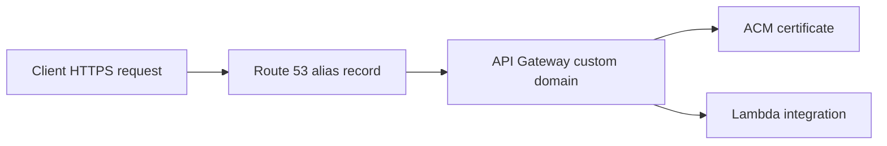

# Custom Domain and SSL for .NET Lambda APIs

This tutorial shows how to publish a .NET Lambda-backed API behind API Gateway with a custom domain and an ACM certificate.

## Architecture Overview

For public HTTPS endpoints, API Gateway terminates TLS with an ACM certificate and routes requests to your Lambda integration.



## Prerequisites

- A deployed Lambda-backed API.
- A registered domain or delegated hosted zone in Route 53.
- An ACM certificate in the same Region as a Regional API endpoint.

## Request a Certificate

```bash
aws acm request-certificate \
  --domain-name "api.example.com" \
  --validation-method DNS \
  --region "$REGION"
```

Use the returned certificate ARN in API Gateway configuration after DNS validation completes.

## SAM Example

```yaml
Resources:
  DotnetApi:
    Type: AWS::Serverless::Api
    Properties:
      StageName: prod
      Domain:
        DomainName: api.example.com
        CertificateArn: arn:aws:acm:$REGION:<account-id>:certificate/xxxxxxxx-xxxx-xxxx-xxxx-xxxxxxxxxxxx
        Route53:
          HostedZoneName: example.com.

  DotnetGuideFunction:
    Type: AWS::Serverless::Function
    Properties:
      Runtime: dotnet8
      Handler: GuideApi::GuideApi.Function::FunctionHandler
      CodeUri: src/GuideApi/
      Events:
        ProxyApi:
          Type: Api
          Properties:
            RestApiId: !Ref DotnetApi
            Path: /{proxy+}
            Method: any
```

## API Mapping Concepts

- Regional API Gateway endpoint.
- ACM certificate attached to the custom domain.
- Base path mapping from the domain to an API stage.
- Route 53 alias record to the API Gateway target domain name.

## CLI Verification

```bash
aws apigateway get-domain-names --region "$REGION"
aws route53 list-hosted-zones
```

Example Route 53 alias target is managed by API Gateway and does not expose your AWS account ID.

## .NET Handler Reminder

The Lambda handler does not change for custom domains; only the HTTP entry point changes.

```csharp
public APIGatewayProxyResponse FunctionHandler(APIGatewayProxyRequest request, ILambdaContext context)
{
    return new APIGatewayProxyResponse
    {
        StatusCode = 200,
        Body = $"Host={request.Headers?[\"Host\"] ?? \"unknown\"}"
    };
}
```

## Operational Guidance

- Prefer Regional endpoints for most Lambda-backed APIs.
- Validate DNS records before cutover.
- Keep stage names and base path mappings explicit.
- Renewals are handled by ACM for eligible managed certificates, but monitor validation state.

## Verification

```bash
curl --silent "https://api.example.com/health"
aws acm describe-certificate \
  --certificate-arn "arn:aws:acm:$REGION:<account-id>:certificate/xxxxxxxx-xxxx-xxxx-xxxx-xxxxxxxxxxxx" \
  --region "$REGION"
```

Successful verification means:

- TLS succeeds with the expected certificate.
- The custom domain routes to the intended API stage.
- The Lambda function receives the original request host header.

## See Also

- [First Deploy](./02-first-deploy.md)
- [Infrastructure as Code](./05-infrastructure-as-code.md)
- [API Gateway REST Recipe](./recipes/api-gateway-rest.md)

## Sources

- [Set up a custom domain name for REST APIs in API Gateway](https://docs.aws.amazon.com/apigateway/latest/developerguide/how-to-custom-domains.html)
- [AWS Certificate Manager User Guide](https://docs.aws.amazon.com/acm/latest/userguide/acm-overview.html)
