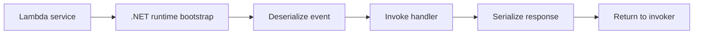

# .NET Runtime Reference for AWS Lambda

This reference page summarizes the .NET runtime-specific concepts you use when building Lambda functions with C#.

## Default Runtime Baseline

- Default target: `.NET 8`
- Language level: `C# 12`
- Common package manager: NuGet
- Common packaging tool: `Amazon.Lambda.Tools`

## Handler String Format

For class library handlers, Lambda uses the format:

```text
Assembly::Namespace.Type::Method
```

Example:

```text
GuideApi::GuideApi.Function::FunctionHandler
```

## Common Handler Signatures

String input and output:

```csharp
public string FunctionHandler(string input, ILambdaContext context)
```

API Gateway proxy event:

```csharp
public APIGatewayProxyResponse FunctionHandler(APIGatewayProxyRequest request, ILambdaContext context)
```

SQS event batch:

```csharp
public SQSBatchResponse FunctionHandler(SQSEvent sqsEvent, ILambdaContext context)
```

## Top-Level Statements and Executables

Lambda can run .NET executables, but class library handlers remain the clearest baseline for most teams because the handler string is explicit and packaging is well understood.

If you use top-level statements, keep the deployment model and generated entry points clear in your build process. For most guide examples, prefer class-based handlers.

## Native AOT

Native AOT can reduce startup latency for some workloads, especially smaller functions with carefully selected dependencies.

Trade-offs:

- Build and publish complexity increases.
- Reflection-heavy libraries may require additional configuration.
- Package validation becomes more important across architectures.

## Supported Versions Guidance

- Prefer `.NET 8` for new functions.
- Maintain older supported runtimes only when required by existing workloads.
- Keep deployment tooling and package references aligned with the runtime version you target.

## Core NuGet Packages

```xml
<ItemGroup>
  <PackageReference Include="Amazon.Lambda.Core" Version="2.*" />
  <PackageReference Include="Amazon.Lambda.Serialization.SystemTextJson" Version="2.*" />
  <PackageReference Include="Amazon.Lambda.APIGatewayEvents" Version="2.*" />
  <PackageReference Include="Amazon.Lambda.SQSEvents" Version="2.*" />
  <PackageReference Include="AWSSDK.SecretsManager" Version="3.*" />
</ItemGroup>
```

## Typical .csproj Settings

```xml
<Project Sdk="Microsoft.NET.Sdk">
  <PropertyGroup>
    <TargetFramework>net8.0</TargetFramework>
    <Nullable>enable</Nullable>
    <ImplicitUsings>enable</ImplicitUsings>
    <GenerateRuntimeConfigurationFiles>true</GenerateRuntimeConfigurationFiles>
    <CopyLocalLockFileAssemblies>true</CopyLocalLockFileAssemblies>
    <AWSProjectType>Lambda</AWSProjectType>
  </PropertyGroup>
</Project>
```

## Amazon.Lambda.Tools Commands

```bash
dotnet tool install --global Amazon.Lambda.Tools
dotnet lambda package --project-location "src/GuideApi"
dotnet lambda deploy-function "$FUNCTION_NAME" --project-location "src/GuideApi" --region "$REGION"
```

## Serialization

Use the assembly-level serializer attribute for JSON payloads.

```csharp
[assembly: LambdaSerializer(typeof(Amazon.Lambda.Serialization.SystemTextJson.DefaultLambdaJsonSerializer))]
```

## Runtime Flow



## Practical Guidance

- Keep handlers small and push business logic into testable services.
- Reuse SDK clients across invocations when possible.
- Rebuild deployment packages when switching architecture or using native dependencies.
- Prefer runtime-specific event packages instead of hand-rolled JSON contracts.

## See Also

- [Run a .NET Lambda Function Locally](./01-local-run.md)
- [First Deploy](./02-first-deploy.md)
- [.NET Recipe Catalog](./recipes/index.md)

## Sources

- [AWS Lambda function handler in C#](https://docs.aws.amazon.com/lambda/latest/dg/csharp-handler.html)
- [Deploy C# Lambda functions with the .NET CLI](https://docs.aws.amazon.com/lambda/latest/dg/csharp-package-cli.html)
- [Compiling .NET Lambda functions with Native AOT](https://docs.aws.amazon.com/lambda/latest/dg/dotnet-native-aot.html)
