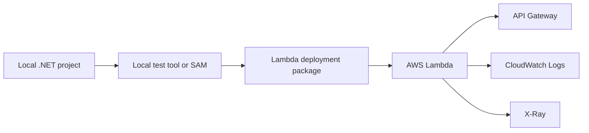

# .NET on AWS Lambda

Use this track to build, test, deploy, and operate AWS Lambda functions with C# 12 and .NET 8.

This guide assumes a zip-based .NET Lambda workflow first, then expands into infrastructure as code, observability, custom domains, layers, and container images.

## Who This Track Is For

- Teams standardizing on .NET 8 for serverless APIs and event processing.
- Developers using `Amazon.Lambda.Tools`, AWS SAM, or CDK with C#.
- Operators who need clear deployment, logging, and configuration patterns.

## Prerequisites

- .NET 8 SDK installed locally.
- AWS CLI configured with credentials and a default profile.
- AWS SAM CLI installed for local emulation and deployment packaging.
- Docker Desktop installed when using SAM emulation or container image flows.
- An IAM execution role ARN available as `$ROLE_ARN`.

## What You'll Build

Across this track, you will build and evolve a small HTTP-focused Lambda service that can also handle event-driven workloads.

- Local execution with the Lambda Test Tool or SAM CLI.
- A first deployment with ZIP packaging.
- Runtime configuration using environment variables, memory, timeout, and architecture.
- Centralized logging, tracing, and metrics.
- Repeatable deployment pipelines with SAM templates, CDK, and GitHub Actions.
- API Gateway custom domains secured with ACM certificates.



## Recommended Project Layout

```text
docs/language-guides/dotnet/
├── index.md
├── 01-local-run.md
├── 02-first-deploy.md
├── 03-configuration.md
├── 04-logging-monitoring.md
├── 05-infrastructure-as-code.md
├── 06-ci-cd.md
├── 07-custom-domain-ssl.md
├── dotnet-runtime.md
└── recipes/
    ├── index.md
    ├── api-gateway-rest.md
    ├── dynamodb-streams.md
    ├── s3-event.md
    ├── sqs-trigger.md
    ├── sns-trigger.md
    ├── secrets-manager.md
    ├── rds-proxy.md
    ├── layers.md
    ├── custom-metrics.md
    └── docker-image.md
```

## Reference Function Shape

Use a simple class-based handler as the default mental model.

```csharp
using Amazon.Lambda.APIGatewayEvents;
using Amazon.Lambda.Core;

[assembly: LambdaSerializer(typeof(Amazon.Lambda.Serialization.SystemTextJson.DefaultLambdaJsonSerializer))]

namespace GuideApi;

public class Function
{
    public APIGatewayProxyResponse FunctionHandler(APIGatewayProxyRequest request, ILambdaContext context)
    {
        context.Logger.LogInformation($"RequestId={context.AwsRequestId}");

        return new APIGatewayProxyResponse
        {
            StatusCode = 200,
            Body = "Hello from .NET 8 on Lambda"
        };
    }
}
```

## Typical .csproj Baseline

```xml
<Project Sdk="Microsoft.NET.Sdk">
  <PropertyGroup>
    <TargetFramework>net8.0</TargetFramework>
    <ImplicitUsings>enable</ImplicitUsings>
    <Nullable>enable</Nullable>
    <GenerateRuntimeConfigurationFiles>true</GenerateRuntimeConfigurationFiles>
    <AWSProjectType>Lambda</AWSProjectType>
    <CopyLocalLockFileAssemblies>true</CopyLocalLockFileAssemblies>
    <PublishReadyToRun>true</PublishReadyToRun>
  </PropertyGroup>

  <ItemGroup>
    <PackageReference Include="Amazon.Lambda.APIGatewayEvents" Version="2.*" />
    <PackageReference Include="Amazon.Lambda.Core" Version="2.*" />
    <PackageReference Include="Amazon.Lambda.Serialization.SystemTextJson" Version="2.*" />
  </ItemGroup>
</Project>
```

## Learning Order

1. Start with [Local Run](./01-local-run.md).
2. Move to [First Deploy](./02-first-deploy.md).
3. Lock down [Configuration](./03-configuration.md).
4. Add [Logging and Monitoring](./04-logging-monitoring.md).
5. Standardize on [Infrastructure as Code](./05-infrastructure-as-code.md).
6. Automate releases with [CI/CD](./06-ci-cd.md).
7. Finish public API delivery with [Custom Domain and SSL](./07-custom-domain-ssl.md).
8. Use the [Runtime Reference](./dotnet-runtime.md) and [Recipes](./recipes/index.md) for event-specific implementations.

## Verification Goals

By the end of this track, verify that you can:

- Package a `.NET 8` Lambda function consistently.
- Deploy with either `sam deploy` or `dotnet lambda deploy-function`.
- Interpret CloudWatch logs and X-Ray traces.
- Handle API Gateway, SQS, SNS, S3, and DynamoDB event contracts.
- Extend the base pattern with layers, Secrets Manager, RDS Proxy, and custom metrics.

## See Also

- [AWS Lambda Practical Guide Home](../../index.md)
- [Run a .NET Lambda Function Locally](./01-local-run.md)
- [.NET Runtime Reference](./dotnet-runtime.md)
- [.NET Recipe Catalog](./recipes/index.md)

## Sources

- [AWS Lambda Developer Guide for .NET](https://docs.aws.amazon.com/lambda/latest/dg/lambda-csharp.html)
- [Using the AWS SAM CLI with .NET](https://docs.aws.amazon.com/serverless-application-model/latest/developerguide/serverless-image-repositories.html)
