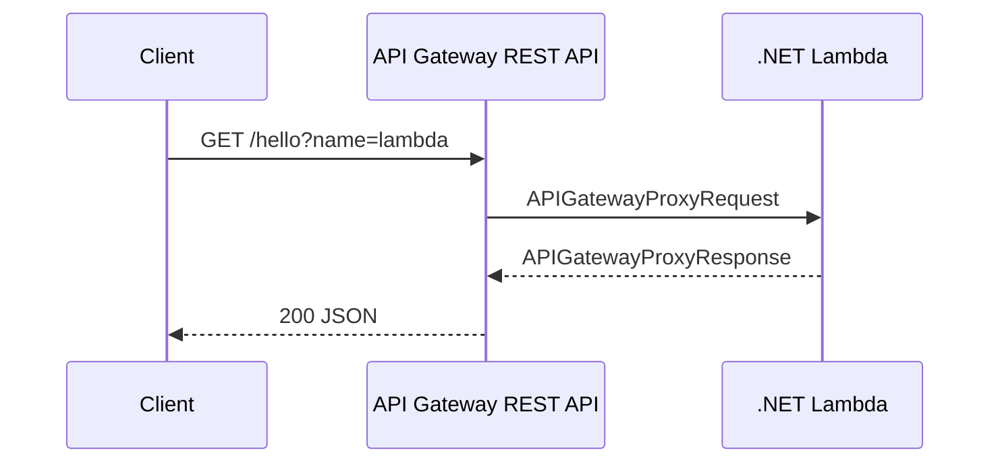

# Recipe: API Gateway REST with APIGatewayProxyRequest

Use this recipe when API Gateway REST API uses Lambda proxy integration and your .NET function needs access to path, query string, headers, and body values.

## Package References

```xml
<ItemGroup>
  <PackageReference Include="Amazon.Lambda.APIGatewayEvents" Version="2.*" />
  <PackageReference Include="Amazon.Lambda.Core" Version="2.*" />
  <PackageReference Include="Amazon.Lambda.Serialization.SystemTextJson" Version="2.*" />
</ItemGroup>
```

## Handler Example

```csharp
using Amazon.Lambda.APIGatewayEvents;
using Amazon.Lambda.Core;

[assembly: LambdaSerializer(typeof(Amazon.Lambda.Serialization.SystemTextJson.DefaultLambdaJsonSerializer))]

public class Function
{
    public APIGatewayProxyResponse FunctionHandler(APIGatewayProxyRequest request, ILambdaContext context)
    {
        var name = request.QueryStringParameters?.GetValueOrDefault("name") ?? "world";

        return new APIGatewayProxyResponse
        {
            StatusCode = 200,
            Headers = new Dictionary<string, string> { ["Content-Type"] = "application/json" },
            Body = $"{{\"message\":\"hello {name}\"}}"
        };
    }
}
```

## SAM Event Wiring

```yaml
Events:
  RestApi:
    Type: Api
    Properties:
      Path: /hello
      Method: get
```

## Local Test Event

```json
{
  "resource": "/hello",
  "path": "/hello",
  "httpMethod": "GET",
  "queryStringParameters": {
    "name": "lambda"
  }
}
```



## Notes

- Use `request.RequestContext` for stage, identity, and resource metadata.
- Return explicit headers for JSON APIs.
- Handle missing query strings and body parsing defensively.

## Verification

```bash
sam local invoke DotnetLocalFunction --event events/apigateway.json --template-file .aws-sam/build/template.yaml
curl --silent "https://api.example.com/hello?name=lambda"
```

Confirm that query strings map correctly and the response body remains valid JSON.

## See Also

- [Custom Domain and SSL](../07-custom-domain-ssl.md)
- [.NET Runtime Reference](../dotnet-runtime.md)
- [SQS Trigger Recipe](./sqs-trigger.md)

## Sources

- [Using Lambda proxy integrations for REST APIs in API Gateway](https://docs.aws.amazon.com/apigateway/latest/developerguide/set-up-lambda-proxy-integrations.html)
- [Amazon.Lambda.APIGatewayEvents package usage](https://docs.aws.amazon.com/lambda/latest/dg/csharp-handler.html)
