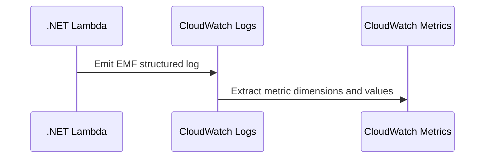

# Recipe: Publish Custom CloudWatch Metrics with EMF

Use this recipe when you need application-level metrics from a .NET Lambda function without making a separate CloudWatch API call for every invocation.

## Package References

```xml
<ItemGroup>
  <PackageReference Include="AWS.Lambda.Powertools.Metrics" Version="1.*" />
  <PackageReference Include="Amazon.Lambda.Core" Version="2.*" />
</ItemGroup>
```

## Handler Example

```csharp
using Amazon.Lambda.Core;
using AWS.Lambda.Powertools.Metrics;

public class Function
{
    [Metrics(CaptureColdStart = true)]
    public string FunctionHandler(string input, ILambdaContext context)
    {
        Metrics.AddMetric("OrdersProcessed", 1, MetricUnit.Count);
        Metrics.AddDimension("Service", "guide-api");
        return "ok";
    }
}
```

## Environment Variables

```yaml
Environment:
  Variables:
    POWERTOOLS_SERVICE_NAME: guide-api
    POWERTOOLS_METRICS_NAMESPACE: AwsLambdaPracticalGuide
```



## Notes

- EMF writes metrics through logs, which reduces explicit API call overhead.
- Use low-cardinality dimensions.
- Pair custom metrics with alarms in CloudWatch.

## Typical Metric Ideas

- Business counts such as `OrdersProcessed` or `RecordsValidated`.
- Outcome measures such as `ValidationFailed`.
- Dependency timing split by downstream system where cardinality is controlled.

## Verification

```bash
aws logs tail "/aws/lambda/$FUNCTION_NAME" --since 10m --region "$REGION"
aws cloudwatch list-metrics --namespace AwsLambdaPracticalGuide --region "$REGION"
```

Confirm that:

- EMF JSON appears in CloudWatch Logs.
- CloudWatch extracts the metric name and namespace.
- Dimensions are stable enough for dashboards and alarms.

## See Also

- [Logging and Monitoring](../04-logging-monitoring.md)
- [SQS Trigger Recipe](./sqs-trigger.md)
- [.NET Recipe Catalog](./index.md)

## Sources

- [Publishing custom metrics from Lambda functions](https://docs.aws.amazon.com/lambda/latest/dg/monitoring-metrics-emf.html)
- [Powertools for AWS Lambda (.NET) metrics utility](https://docs.aws.amazon.com/powertools/dotnet/latest/core/metrics/)
