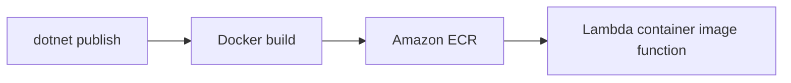

# Recipe: Deploy a .NET Lambda Function as a Container Image

Use this recipe when your .NET Lambda workload needs container image packaging, larger dependency sets, or a unified Docker-based build process.

## Dockerfile Example

```dockerfile
FROM public.ecr.aws/lambda/dotnet:8 AS base
WORKDIR /var/task

FROM mcr.microsoft.com/dotnet/sdk:8.0 AS build
WORKDIR /src
COPY src/GuideApi/GuideApi.csproj src/GuideApi/
RUN dotnet restore src/GuideApi/GuideApi.csproj
COPY src/GuideApi/ src/GuideApi/
RUN dotnet publish src/GuideApi/GuideApi.csproj --configuration Release --framework net8.0 --output /app/publish

FROM base AS final
COPY --from=build /app/publish ./
CMD ["GuideApi::GuideApi.Function::FunctionHandler"]
```

## Build and Push

```bash
aws ecr create-repository --repository-name "$FUNCTION_NAME" --region "$REGION"

docker build --tag "$FUNCTION_NAME:latest" .
docker tag "$FUNCTION_NAME:latest" "$ACCOUNT_ID.dkr.ecr.$REGION.amazonaws.com/$FUNCTION_NAME:latest"
aws ecr get-login-password --region "$REGION" | docker login --username AWS --password-stdin "$ACCOUNT_ID.dkr.ecr.$REGION.amazonaws.com"
docker push "$ACCOUNT_ID.dkr.ecr.$REGION.amazonaws.com/$FUNCTION_NAME:latest"
```

Use `<account-id>` in documentation examples:

```text
<account-id>.dkr.ecr.$REGION.amazonaws.com/$FUNCTION_NAME:latest
```

## Create the Function

```bash
aws lambda create-function \
  --function-name "$FUNCTION_NAME" \
  --package-type Image \
  --code "ImageUri=<account-id>.dkr.ecr.$REGION.amazonaws.com/$FUNCTION_NAME:latest" \
  --role "$ROLE_ARN" \
  --region "$REGION"
```



## Notes

- Lambda still controls the execution environment even with container images.
- Keep the final image small and deterministic.
- Rebuild and push a new image for every deployment revision.

## When to Prefer Images

- Native dependencies complicate ZIP packaging.
- Multiple functions share a Docker-based build workflow.
- You need full control over the build stage while still using the Lambda base image.

## Verification

```bash
aws lambda get-function \
  --function-name "$FUNCTION_NAME" \
  --region "$REGION"

aws ecr describe-images \
  --repository-name "$FUNCTION_NAME" \
  --region "$REGION"
```

Check that the function package type is `Image` and that the expected image tag exists in Amazon ECR.

## See Also

- [Infrastructure as Code](../05-infrastructure-as-code.md)
- [Layers Recipe](./layers.md)
- [.NET Recipe Catalog](./index.md)

## Sources

- [Create a Lambda function using a container image](https://docs.aws.amazon.com/lambda/latest/dg/images-create.html)
- [Deploy .NET Lambda functions with container images](https://docs.aws.amazon.com/lambda/latest/dg/csharp-image.html)
