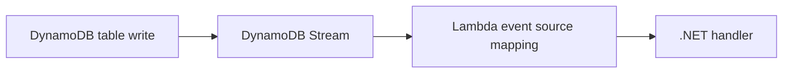

# Recipe: DynamoDB Streams with DynamoDBEvent

Use this recipe when a .NET Lambda function reacts to item-level changes in a DynamoDB table through DynamoDB Streams.

## Package References

```xml
<ItemGroup>
  <PackageReference Include="Amazon.Lambda.Core" Version="2.*" />
  <PackageReference Include="Amazon.Lambda.DynamoDBEvents" Version="2.*" />
</ItemGroup>
```

## Handler Example

```csharp
using Amazon.Lambda.Core;
using Amazon.Lambda.DynamoDBEvents;

public class Function
{
    public async Task FunctionHandler(DynamoDBEvent dynamoEvent, ILambdaContext context)
    {
        foreach (var record in dynamoEvent.Records)
        {
            var eventName = record.EventName;
            var keys = string.Join(",", record.Dynamodb.Keys.Keys);
            context.Logger.LogInformation($"Event={eventName} Keys={keys}");
        }

        await Task.CompletedTask;
    }
}
```

## Trigger Configuration

```yaml
Events:
  Stream:
    Type: DynamoDB
    Properties:
      Stream: arn:aws:dynamodb:$REGION:<account-id>:table/MyTable/stream/2026-04-07T00:00:00.000
      BatchSize: 100
      StartingPosition: LATEST
```



## Notes

- Stream records can include new images, old images, or keys only depending on stream view type.
- Lambda polls the stream through an event source mapping.
- Idempotency matters because batches can be retried.

## Operational Guidance

- Keep batch handlers safe for replay.
- Send failed records to an alerting path if retries exceed business tolerance.
- Use CloudWatch metrics and logs to detect iterator age growth.

## Verification

```bash
aws lambda list-event-source-mappings \
  --function-name "$FUNCTION_NAME" \
  --region "$REGION"
```

Verify that the event source mapping is enabled and points at the expected stream ARN.

## See Also

- [S3 Event Recipe](./s3-event.md)
- [SQS Trigger Recipe](./sqs-trigger.md)
- [.NET Recipe Catalog](./index.md)

## Sources

- [Using Lambda with DynamoDB](https://docs.aws.amazon.com/lambda/latest/dg/with-ddb.html)
- [DynamoDB Streams and Lambda triggers](https://docs.aws.amazon.com/amazondynamodb/latest/developerguide/Streams.Lambda.html)
