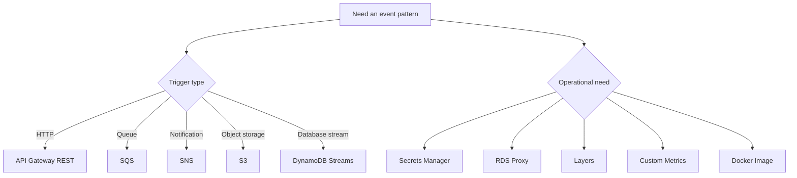

# .NET Lambda Recipe Catalog

Use these recipes when you already know the event source or integration pattern you need.

## Recipe Groups

| Area | Recipes |
|---|---|
| API and HTTP | [API Gateway REST](./api-gateway-rest.md) |
| Event processing | [DynamoDB Streams](./dynamodb-streams.md), [S3 Event](./s3-event.md), [SQS Trigger](./sqs-trigger.md), [SNS Trigger](./sns-trigger.md) |
| Data and secrets | [Secrets Manager](./secrets-manager.md), [RDS Proxy](./rds-proxy.md) |
| Reuse and telemetry | [Layers](./layers.md), [Custom Metrics](./custom-metrics.md) |
| Packaging | [Docker Image](./docker-image.md) |

## Shared Package Baseline

```xml
<ItemGroup>
  <PackageReference Include="Amazon.Lambda.Core" Version="2.*" />
  <PackageReference Include="Amazon.Lambda.Serialization.SystemTextJson" Version="2.*" />
</ItemGroup>
```

Add event-specific packages only where needed.

## Handler Selection Guide

- Choose `APIGatewayProxyRequest` for REST API proxy integrations.
- Choose `DynamoDBEvent`, `S3Event`, `SQSEvent`, and `SNSEvent` for service-native triggers.
- Use `SQSBatchResponse` for partial batch failure reporting.
- Use AWS SDK clients such as `AmazonSecretsManagerClient` for managed service access.



## Recommended Use Pattern

1. Start with the event package and handler signature.
2. Add only the SDK packages required by the integration.
3. Define the trigger in SAM or CDK.
4. Verify locally when possible, then validate in AWS.

## Packaging Checklist

- Keep the handler string aligned with the compiled assembly name.
- Default new workloads to `dotnet8` and `arm64`.
- Put secrets in Secrets Manager instead of plaintext environment variables.
- Reuse AWS SDK clients across invocations when calling downstream services.
- Prefer structured logs so CloudWatch Logs Insights queries stay stable.

## How to Read the Recipes

Each recipe includes:

- The NuGet packages usually required for the pattern.
- A realistic handler signature with AWS event types.
- A short SAM or CLI configuration snippet.
- A Mermaid diagram that shows the service interaction path.
- Notes on retries, idempotency, IAM, or packaging concerns.

## Common Validation Commands

```bash
dotnet restore src/GuideApi/GuideApi.csproj
dotnet build src/GuideApi/GuideApi.csproj --configuration Release
sam validate --template-file template.yaml
sam build --template-file template.yaml
```

Use event JSON fixtures to verify serialization before enabling production triggers.

## See Also

- [Run a .NET Lambda Function Locally](../01-local-run.md)
- [.NET Runtime Reference](../dotnet-runtime.md)
- [Infrastructure as Code](../05-infrastructure-as-code.md)

## Sources

- [Use Lambda with event sources](https://docs.aws.amazon.com/lambda/latest/dg/lambda-services.html)
- [AWS SDK for .NET Developer Guide](https://docs.aws.amazon.com/sdk-for-net/v3/developer-guide/welcome.html)
