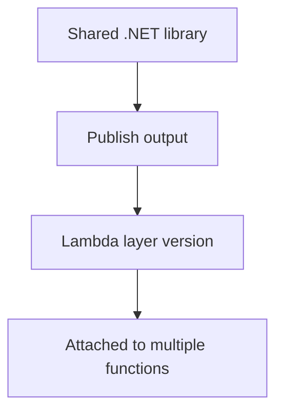

# Recipe: Lambda Layers for Shared Assemblies

Use this recipe when multiple .NET Lambda functions should share libraries, utilities, or native dependencies through a Lambda layer.

## Layer Layout

For .NET, package the layer contents so the runtime can load assemblies from the expected path.

```text
layer/
└── dotnet/
    └── shared/
        ├── SharedLibrary.dll
        └── SharedLibrary.pdb
```

## Publish Shared Code

```bash
dotnet publish src/SharedLibrary/SharedLibrary.csproj \
  --configuration Release \
  --framework net8.0 \
  --output "layer/dotnet/shared"
```

## Publish the Layer

```bash
aws lambda publish-layer-version \
  --layer-name dotnet-shared \
  --zip-file fileb://layer.zip \
  --compatible-runtimes dotnet8 \
  --compatible-architectures arm64 \
  --region "$REGION"
```

## Attach the Layer in SAM

```yaml
Layers:
  - arn:aws:lambda:$REGION:<account-id>:layer:dotnet-shared:1
```



## Notes

- Rebuild the layer when shared dependencies change.
- Version layers explicitly and update functions deliberately.
- Keep the layer small to reduce deployment and cold-start overhead.

## Operational Guidance

- Match layer architecture with the function architecture.
- Test layer changes against every consuming function before rollout.
- Avoid placing frequently changing application logic into shared layers.

## Verification

```bash
aws lambda list-layer-versions \
  --layer-name dotnet-shared \
  --region "$REGION"

aws lambda get-function-configuration \
  --function-name "$FUNCTION_NAME" \
  --region "$REGION"
```

Confirm that the function references the intended layer version ARN.

## See Also

- [Infrastructure as Code](../05-infrastructure-as-code.md)
- [Docker Image Recipe](./docker-image.md)
- [.NET Runtime Reference](../dotnet-runtime.md)

## Sources

- [Managing Lambda dependencies with layers](https://docs.aws.amazon.com/lambda/latest/dg/chapter-layers.html)
- [Packaging layers for .NET](https://docs.aws.amazon.com/lambda/latest/dg/dotnet-layers.html)
