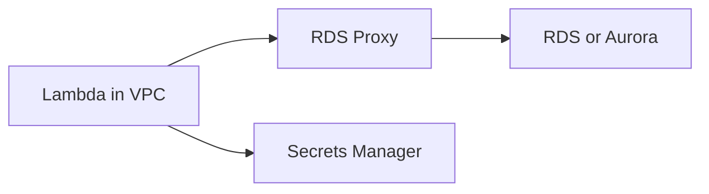

# Recipe: Connect to RDS through RDS Proxy

Use this recipe when a .NET Lambda function connects to a relational database and you want more efficient connection reuse with Amazon RDS Proxy.

## Package References

PostgreSQL example:

```xml
<ItemGroup>
  <PackageReference Include="Npgsql" Version="8.*" />
  <PackageReference Include="AWSSDK.SecretsManager" Version="3.*" />
  <PackageReference Include="Amazon.Lambda.Core" Version="2.*" />
</ItemGroup>
```

MySQL workloads typically use `MySqlConnector` instead.

## Handler Example

```csharp
using Amazon.Lambda.Core;
using Npgsql;

public class Function
{
    public async Task<string> FunctionHandler(string input, ILambdaContext context)
    {
        var connectionString = Environment.GetEnvironmentVariable("DB_PROXY_ENDPOINT");

        await using var connection = new NpgsqlConnection(connectionString);
        await connection.OpenAsync();

        await using var command = new NpgsqlCommand("select current_timestamp", connection);
        var result = await command.ExecuteScalarAsync();

        return result?.ToString() ?? "no result";
    }
}
```

## Infrastructure Requirements

- Lambda and RDS Proxy must be reachable through the selected VPC subnets and security groups.
- The function execution role needs permission to retrieve credentials if you use Secrets Manager.
- Set the database endpoint to the proxy endpoint, not the database instance endpoint.



## Notes

- RDS Proxy helps reduce database connection pressure during bursts.
- Keep Lambda timeout aligned with expected query duration plus network overhead.
- Validate VPC cold-start impact for your workload profile.

## Verification

```bash
aws rds describe-db-proxies --region "$REGION"
aws lambda get-function-configuration --function-name "$FUNCTION_NAME" --region "$REGION"
```

Verify that:

- The function runs in subnets that can reach the proxy.
- Security groups allow traffic from Lambda to the proxy.
- The connection string points at the proxy endpoint rather than the database instance.

## See Also

- [Configuration](../03-configuration.md)
- [Secrets Manager Recipe](./secrets-manager.md)
- [.NET Recipe Catalog](./index.md)

## Sources

- [Using AWS Lambda with Amazon RDS](https://docs.aws.amazon.com/lambda/latest/dg/services-rds.html)
- [Amazon RDS Proxy concepts](https://docs.aws.amazon.com/AmazonRDS/latest/UserGuide/rds-proxy.html)
