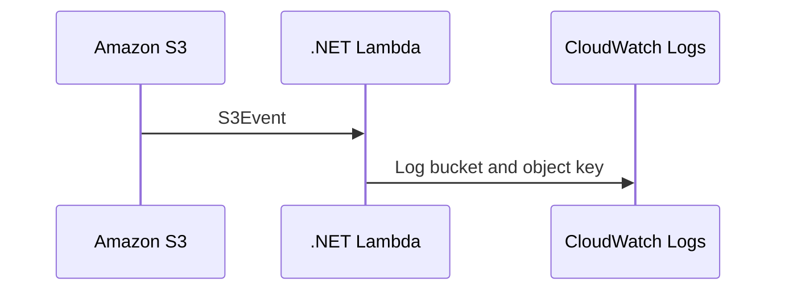

# Recipe: S3 Event with S3Event

Use this recipe when Amazon S3 should invoke a .NET Lambda function after object creation or deletion events.

## Package References

```xml
<ItemGroup>
  <PackageReference Include="Amazon.Lambda.Core" Version="2.*" />
  <PackageReference Include="Amazon.Lambda.S3Events" Version="2.*" />
  <PackageReference Include="AWSSDK.S3" Version="3.*" />
</ItemGroup>
```

## Handler Example

```csharp
using Amazon.Lambda.Core;
using Amazon.Lambda.S3Events;

public class Function
{
    public async Task FunctionHandler(S3Event s3Event, ILambdaContext context)
    {
        foreach (var record in s3Event.Records)
        {
            context.Logger.LogInformation($"Bucket={record.S3.Bucket.Name} Key={record.S3.Object.Key}");
        }

        await Task.CompletedTask;
    }
}
```

## Trigger Configuration

```yaml
Events:
  ObjectCreated:
    Type: S3
    Properties:
      Bucket: !Ref InputBucket
      Events: s3:ObjectCreated:*
```



## Notes

- URL-decode keys when filenames may contain spaces or special characters.
- Keep handlers idempotent because S3 notifications are asynchronous.
- Use destination prefixes or bucket separation to avoid recursive invocation loops.

## Verification

```bash
aws s3api put-object \
  --bucket my-input-bucket \
  --key sample.txt \
  --body sample.txt \
  --region "$REGION"

aws logs tail "/aws/lambda/$FUNCTION_NAME" --since 10m --region "$REGION"
```

Confirm that the function logs the expected bucket and object key after the upload.

## See Also

- [SNS Trigger Recipe](./sns-trigger.md)
- [Layers Recipe](./layers.md)
- [.NET Recipe Catalog](./index.md)

## Sources

- [Using Lambda with Amazon S3](https://docs.aws.amazon.com/lambda/latest/dg/with-s3.html)
- [Process Amazon S3 event notifications with Lambda](https://docs.aws.amazon.com/AmazonS3/latest/userguide/notification-content-structure.html)
