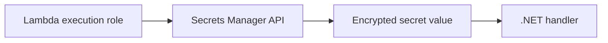

# Recipe: Read Secrets with AmazonSecretsManagerClient

Use this recipe when a .NET Lambda function must retrieve credentials or configuration from AWS Secrets Manager at runtime.

## Package References

```xml
<ItemGroup>
  <PackageReference Include="AWSSDK.SecretsManager" Version="3.*" />
  <PackageReference Include="Amazon.Lambda.Core" Version="2.*" />
</ItemGroup>
```

## Handler Example

```csharp
using Amazon.Lambda.Core;
using Amazon.SecretsManager;
using Amazon.SecretsManager.Model;

public class Function
{
    private static readonly IAmazonSecretsManager SecretsManager = new AmazonSecretsManagerClient();

    public async Task<string> FunctionHandler(string input, ILambdaContext context)
    {
        var secretId = Environment.GetEnvironmentVariable("DB_SECRET_NAME") ?? "guide/db";
        var response = await SecretsManager.GetSecretValueAsync(new GetSecretValueRequest { SecretId = secretId });
        context.Logger.LogInformation($"Loaded secret metadata for {secretId}");
        return response.SecretString ?? string.Empty;
    }
}
```

## IAM Requirement

Grant `secretsmanager:GetSecretValue` on the target secret.

```yaml
Policies:
  - Statement:
      - Effect: Allow
        Action:
          - secretsmanager:GetSecretValue
        Resource: arn:aws:secretsmanager:$REGION:<account-id>:secret:guide/db-*
```



## Notes

- Reuse the SDK client across invocations.
- Cache secret values if the function is invoked frequently and rotation requirements allow it.
- Never log the secret payload.

## Verification

```bash
aws secretsmanager describe-secret \
  --secret-id "guide/db" \
  --region "$REGION"

aws lambda invoke \
  --function-name "$FUNCTION_NAME" \
  --payload '"check-secret"' \
  --cli-binary-format raw-in-base64-out \
  secret-response.json
```

Confirm that invocation succeeds and logs show secret retrieval metadata without exposing the secret value.

## See Also

- [Configuration](../03-configuration.md)
- [RDS Proxy Recipe](./rds-proxy.md)
- [.NET Recipe Catalog](./index.md)

## Sources

- [Use Secrets Manager secrets in Lambda functions](https://docs.aws.amazon.com/lambda/latest/dg/with-secrets-manager.html)
- [GetSecretValue API Reference](https://docs.aws.amazon.com/secretsmanager/latest/apireference/API_GetSecretValue.html)
