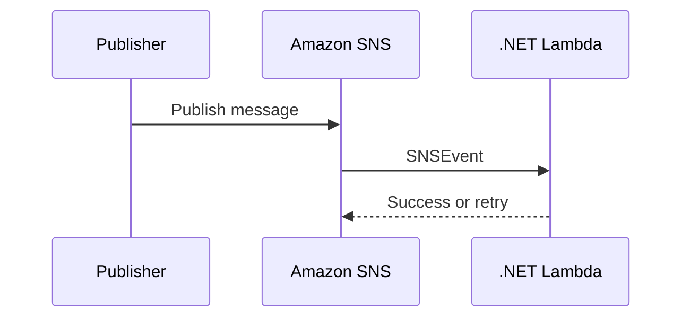

# Recipe: SNS Trigger with SNSEvent

Use this recipe when Amazon SNS fan-out delivers notifications to a .NET Lambda function.

## Package References

```xml
<ItemGroup>
  <PackageReference Include="Amazon.Lambda.Core" Version="2.*" />
  <PackageReference Include="Amazon.Lambda.SNSEvents" Version="2.*" />
</ItemGroup>
```

## Handler Example

```csharp
using Amazon.Lambda.Core;
using Amazon.Lambda.SNSEvents;

public class Function
{
    public async Task FunctionHandler(SNSEvent snsEvent, ILambdaContext context)
    {
        foreach (var record in snsEvent.Records)
        {
            context.Logger.LogInformation($"Subject={record.Sns.Subject} Message={record.Sns.Message}");
        }

        await Task.CompletedTask;
    }
}
```

## Trigger Configuration

```yaml
Events:
  Notifications:
    Type: SNS
    Properties:
      Topic: arn:aws:sns:$REGION:<account-id>:guide-topic
```



## Notes

- SNS invokes Lambda asynchronously.
- Message attributes can carry routing metadata.
- Use DLQ or on-failure destinations for downstream error handling strategies.

## Verification

```bash
aws sns publish \
  --topic-arn "arn:aws:sns:$REGION:<account-id>:guide-topic" \
  --message "hello from sns" \
  --region "$REGION"

aws logs tail "/aws/lambda/$FUNCTION_NAME" --since 10m --region "$REGION"
```

Confirm that the function receives the SNS message and logs the expected subject or payload.

## See Also

- [SQS Trigger Recipe](./sqs-trigger.md)
- [Secrets Manager Recipe](./secrets-manager.md)
- [.NET Recipe Catalog](./index.md)

## Sources

- [Using Lambda with Amazon SNS](https://docs.aws.amazon.com/lambda/latest/dg/with-sns.html)
- [Amazon SNS message delivery](https://docs.aws.amazon.com/sns/latest/dg/sns-message-and-json-formats.html)
