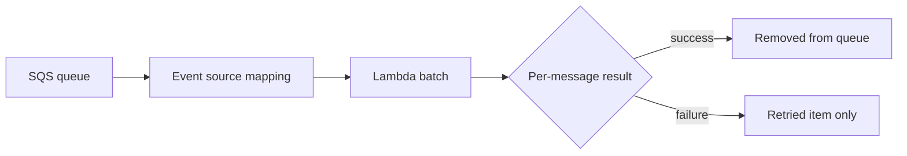

# Recipe: SQS Trigger with SQSEvent and Batch Item Failures

Use this recipe when Lambda consumes messages from an SQS queue and you need partial batch failure reporting.

## Package References

```xml
<ItemGroup>
  <PackageReference Include="Amazon.Lambda.Core" Version="2.*" />
  <PackageReference Include="Amazon.Lambda.SQSEvents" Version="2.*" />
</ItemGroup>
```

## Handler Example

```csharp
using Amazon.Lambda.Core;
using Amazon.Lambda.SQSEvents;

public class Function
{
    public SQSBatchResponse FunctionHandler(SQSEvent sqsEvent, ILambdaContext context)
    {
        var failures = new List<SQSBatchResponse.BatchItemFailure>();

        foreach (var message in sqsEvent.Records)
        {
            try
            {
                context.Logger.LogInformation($"MessageId={message.MessageId}");
            }
            catch
            {
                failures.Add(new SQSBatchResponse.BatchItemFailure { ItemIdentifier = message.MessageId });
            }
        }

        return new SQSBatchResponse(failures);
    }
}
```

## SAM Trigger Configuration

```yaml
Events:
  Queue:
    Type: SQS
    Properties:
      Queue: arn:aws:sqs:$REGION:<account-id>:guide-queue
      BatchSize: 10
      FunctionResponseTypes:
        - ReportBatchItemFailures
```



## Notes

- Turn on `ReportBatchItemFailures` to avoid retrying successful records.
- Set queue visibility timeout longer than the function timeout.
- Pair with a dead-letter queue or redrive policy.

## See Also

- [SNS Trigger Recipe](./sns-trigger.md)
- [Custom Metrics Recipe](./custom-metrics.md)
- [.NET Runtime Reference](../dotnet-runtime.md)

## Sources

- [Using Lambda with Amazon SQS](https://docs.aws.amazon.com/lambda/latest/dg/with-sqs.html)
- [Reporting batch item failures for Lambda and SQS](https://docs.aws.amazon.com/lambda/latest/dg/services-sqs-errorhandling.html)
