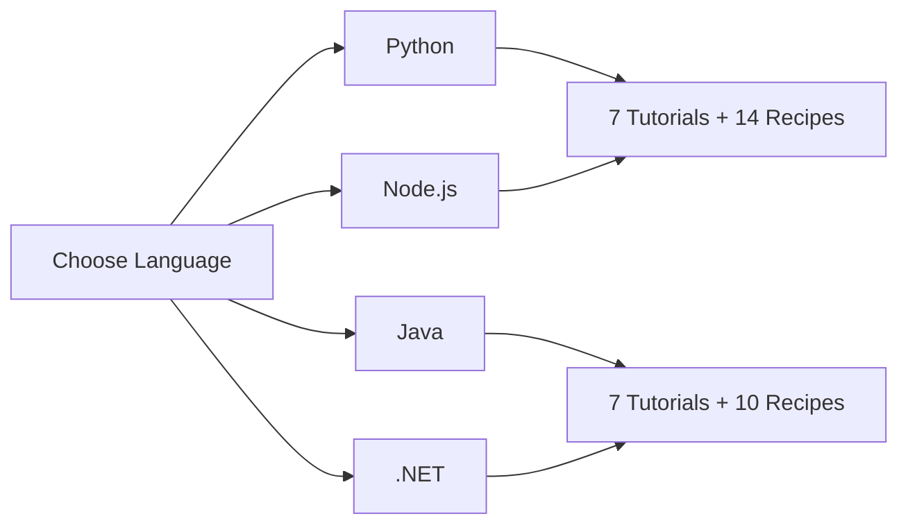

# Language Guides

Step-by-step tutorials and integration recipes for building AWS Lambda functions in four languages.

Each track follows the same progression: local development, first deploy, configuration, logging, infrastructure as code, CI/CD, and custom domains. After the tutorials, recipes show how to integrate Lambda with common AWS services.

## Available Tracks

| Language | Runtime | Tutorials | Recipes | Start |
|---|---|---|---|---|
| Python | python3.12 | 7 | 14 | [Python Track](python/index.md) |
| Node.js | nodejs20.x | 7 | 14 | [Node.js Track](nodejs/index.md) |
| Java | java21 | 7 | 10 | [Java Track](java/index.md) |
| .NET | dotnet8 | 7 | 10 | [.NET Track](dotnet/index.md) |

## Tutorial Progression

Every language track follows this sequence:

| Step | Tutorial | What You Learn |
|---|---|---|
| 1 | Local Run | Run and test your Lambda function locally with SAM CLI |
| 2 | First Deploy | Deploy to AWS and invoke your function |
| 3 | Configuration | Environment variables, memory, timeout, layers |
| 4 | Logging and Monitoring | Structured logging, CloudWatch, X-Ray tracing |
| 5 | Infrastructure as Code | SAM templates and CDK |
| 6 | CI/CD | Automated deployment pipelines |
| 7 | Custom Domain and SSL | API Gateway with custom domain and ACM certificate |

## Recipe Categories

Recipes are self-contained guides for integrating Lambda with specific AWS services:

| Category | Recipes |
|---|---|
| Event Sources | API Gateway REST, API Gateway HTTP, DynamoDB Streams, S3 Events, SQS, SNS, EventBridge, Step Functions |
| Data and Secrets | Secrets Manager, Parameter Store, RDS Proxy |
| Packaging | Lambda Layers, Container Images |
| Observability | Custom CloudWatch Metrics |

## Choosing a Language

!!! tip
    If you are new to Lambda, start with **Python** or **Node.js**. Both have fast cold starts and minimal packaging requirements.

- **Python**: Fastest iteration cycle, rich AWS SDK (boto3), extensive ecosystem for data processing.
- **Node.js**: Low cold start overhead, native async/await, strong for API and event-driven workloads.
- **Java**: Enterprise patterns with Spring and dependency injection, SnapStart for cold start reduction.
- **.NET**: First-class AWS SDK support, native AOT compilation for performance, familiar for C# teams.

## See Also

- [Start Here — Overview](../start-here/overview.md)
- [Platform — Execution Model](../platform/execution-model.md)
- [Best Practices — Performance](../best-practices/performance.md)

## Sources

- [AWS Lambda — Supported Runtimes](https://docs.aws.amazon.com/lambda/latest/dg/lambda-runtimes.html)
- [AWS Lambda Developer Guide](https://docs.aws.amazon.com/lambda/latest/dg/welcome.html)
