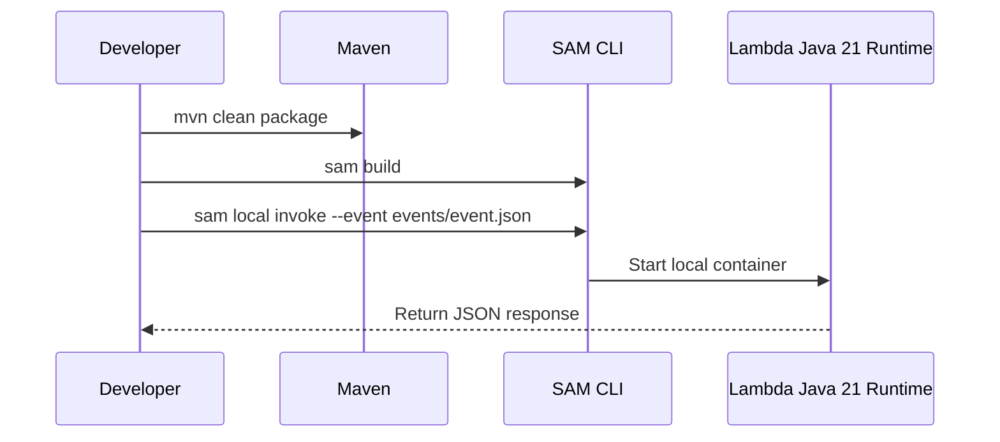

# Run a Java Lambda Function Locally

This tutorial builds a minimal Java 21 Lambda function with Maven and runs it locally with AWS SAM CLI.
The goal is to validate the handler contract, event shape, and packaging flow before the first deployment.

## Prerequisites

- Java 21 installed locally.
- Maven installed locally.
- AWS SAM CLI installed.
- Docker running locally for `sam local invoke`.

## What You'll Build

You will build a small function that:

- Implements `RequestHandler<Map<String,String>, Map<String,Object>>`.
- Packages as a ZIP-compatible Maven build artifact.
- Runs locally with `sam build` and `sam local invoke`.
- Reads one JSON event file from the `events/` directory.



## Project Files

```text
.
├── pom.xml
├── template.yaml
├── events/
│   └── event.json
└── src/main/java/com/example/lambda/Handler.java
```

## Create the Maven Project

Use a shaded JAR so the deployment package contains your code and dependencies.

```xml
<project xmlns="http://maven.apache.org/POM/4.0.0"
         xmlns:xsi="http://www.w3.org/2001/XMLSchema-instance"
         xsi:schemaLocation="http://maven.apache.org/POM/4.0.0 https://maven.apache.org/xsd/maven-4.0.0.xsd">
    <modelVersion>4.0.0</modelVersion>
    <groupId>com.example</groupId>
    <artifactId>java-lambda-guide</artifactId>
    <version>1.0.0</version>

    <properties>
        <maven.compiler.release>21</maven.compiler.release>
        <project.build.sourceEncoding>UTF-8</project.build.sourceEncoding>
    </properties>

    <dependencies>
        <dependency>
            <groupId>com.amazonaws</groupId>
            <artifactId>aws-lambda-java-core</artifactId>
            <version>1.2.3</version>
        </dependency>
    </dependencies>

    <build>
        <plugins>
            <plugin>
                <groupId>org.apache.maven.plugins</groupId>
                <artifactId>maven-shade-plugin</artifactId>
                <version>3.5.2</version>
                <executions>
                    <execution>
                        <phase>package</phase>
                        <goals>
                            <goal>shade</goal>
                        </goals>
                    </execution>
                </executions>
            </plugin>
        </plugins>
    </build>
</project>
```

## Create the Handler

```java
package com.example.lambda;

import com.amazonaws.services.lambda.runtime.Context;
import com.amazonaws.services.lambda.runtime.RequestHandler;
import java.util.Map;

public class Handler implements RequestHandler<Map<String, String>, Map<String, Object>> {
    @Override
    public Map<String, Object> handleRequest(Map<String, String> event, Context context) {
        String name = event.getOrDefault("name", "Lambda");
        context.getLogger().log("Handling request for " + name);

        return Map.of(
            "message", "Hello, " + name,
            "requestId", context.getAwsRequestId()
        );
    }
}
```

## Create the SAM Template

```yaml
AWSTemplateFormatVersion: '2010-09-09'
Transform: AWS::Serverless-2016-10-31
Resources:
  JavaLocalFunction:
    Type: AWS::Serverless::Function
    Properties:
      CodeUri: .
      Handler: com.example.lambda.Handler::handleRequest
      Runtime: java21
      MemorySize: 1024
      Timeout: 10
```

## Add a Sample Event

```json
{
  "name": "SAM"
}
```

Save it as `events/event.json`.

## Build and Invoke Locally

```bash
mvn clean package
sam build
sam local invoke "JavaLocalFunction" --event "events/event.json"
```

Expected response:

```json
{
  "message": "Hello, SAM",
  "requestId": "example-request-id"
}
```

## Useful Local Iteration Pattern

When you change code, repeat:

```bash
mvn clean package
sam build
sam local invoke "JavaLocalFunction" --event "events/event.json"
```

!!! tip
    Use `sam local invoke` when you want to test the Lambda handler contract.
    Use ordinary unit tests for business logic that does not require the runtime wrapper.

## Verification

- `mvn clean package` succeeds.
- `sam build` creates the `.aws-sam/` output.
- `sam local invoke` returns valid JSON.
- The handler class name and method match the SAM template.

## See Also

- [Java on AWS Lambda](./index.md)
- [Deploy Your First Java Lambda Function](./02-first-deploy.md)
- [Java Runtime Reference](./java-runtime.md)
- [REST API Gateway Recipe](./recipes/api-gateway-rest.md)

## Sources

- [Building Lambda functions with Java](https://docs.aws.amazon.com/lambda/latest/dg/lambda-java.html)
- [Defining Lambda handler methods in Java](https://docs.aws.amazon.com/lambda/latest/dg/java-handler.html)
- [Invoking Lambda functions locally with AWS SAM CLI](https://docs.aws.amazon.com/serverless-application-model/latest/developerguide/using-sam-cli-local-invoke.html)
