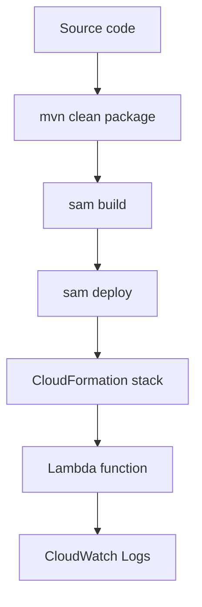

# Deploy Your First Java Lambda Function

This tutorial deploys the Java function to AWS using AWS SAM and shows the equivalent AWS CLI flow for direct Lambda deployment.
Use SAM for repeatable infrastructure and use raw CLI commands when you need to understand the underlying API calls.

## Prerequisites

- Completed [Run a Java Lambda Function Locally](./01-local-run.md).
- A deployment bucket that SAM can use for artifacts, or guided SAM deploy.
- An IAM execution role ARN in `$ROLE_ARN`.

## Deployment Flow



## Update the SAM Template

Add a concrete function name, architecture, and outputs.

```yaml
AWSTemplateFormatVersion: '2010-09-09'
Transform: AWS::Serverless-2016-10-31
Resources:
  JavaGuideFunction:
    Type: AWS::Serverless::Function
    Properties:
      FunctionName: !Sub '${AWS::StackName}-java-guide'
      CodeUri: .
      Handler: com.example.lambda.Handler::handleRequest
      Runtime: java21
      Architectures:
        - x86_64
      MemorySize: 1024
      Timeout: 10
Outputs:
  FunctionName:
    Value: !Ref JavaGuideFunction
  FunctionArn:
    Value: !GetAtt JavaGuideFunction.Arn
```

## Deploy with AWS SAM

```bash
export REGION="ap-northeast-2"
export STACK_NAME="java-lambda-guide"

mvn clean package
sam build
sam deploy \
  --stack-name "$STACK_NAME" \
  --region "$REGION" \
  --capabilities "CAPABILITY_IAM" \
  --guided
```

During guided deploy, accept or set:

- Stack name.
- AWS Region.
- Confirmation behavior.
- IAM capability acknowledgement.

After the first deploy, a `samconfig.toml` file stores the answers for repeat deployments.

## Invoke the Deployed Function

Retrieve the function name from stack outputs or the console, then invoke it.

```bash
export FUNCTION_NAME="java-lambda-guide-java-guide"

aws lambda invoke \
  --function-name "$FUNCTION_NAME" \
  --cli-binary-format raw-in-base64-out \
  --payload '{"name":"AWS"}' \
  response.json

aws logs tail "/aws/lambda/$FUNCTION_NAME" --follow
```

## Direct AWS CLI Deployment

If you want the lower-level flow, build the ZIP and call Lambda APIs directly.

```bash
zip --junk-paths function.zip target/java-lambda-guide-1.0.0.jar

aws lambda create-function \
  --function-name "$FUNCTION_NAME" \
  --runtime "java21" \
  --handler "com.example.lambda.Handler::handleRequest" \
  --architectures "x86_64" \
  --memory-size 1024 \
  --timeout 10 \
  --role "$ROLE_ARN" \
  --zip-file "fileb://function.zip"
```

For later code-only deployments:

```bash
mvn clean package
zip --junk-paths function.zip target/java-lambda-guide-1.0.0.jar

aws lambda update-function-code \
  --function-name "$FUNCTION_NAME" \
  --zip-file "fileb://function.zip"
```

## Add an API Event with SAM

If you want an HTTP endpoint immediately, add this event block:

```yaml
Events:
  HelloApi:
    Type: Api
    Properties:
      Path: /hello
      Method: post
```

Then redeploy with `sam deploy`.

!!! note
    SAM deploys Lambda, execution roles, permissions, and optional API Gateway resources through CloudFormation.
    That makes rollback and stack cleanup easier than scripting each API call independently.

## Verification

- `sam deploy` completes without rollback.
- `aws lambda invoke` returns a valid JSON payload.
- CloudWatch Logs receives one log stream for the function.
- Stack outputs expose the function ARN.

## See Also

- [Run a Java Lambda Function Locally](./01-local-run.md)
- [Configuration for Java Lambda Functions](./03-configuration.md)
- [Infrastructure as Code for Java Lambda](./05-infrastructure-as-code.md)
- [Java Runtime Reference](./java-runtime.md)

## Sources

- [Deploying Lambda applications with AWS SAM](https://docs.aws.amazon.com/serverless-application-model/latest/developerguide/deploying-using-sam-cli.html)
- [CreateFunction API for AWS Lambda](https://docs.aws.amazon.com/lambda/latest/api/API_CreateFunction.html)
- [Invoking Lambda functions with the AWS CLI](https://docs.aws.amazon.com/lambda/latest/dg/example_lambda_Invoke_section.html)
