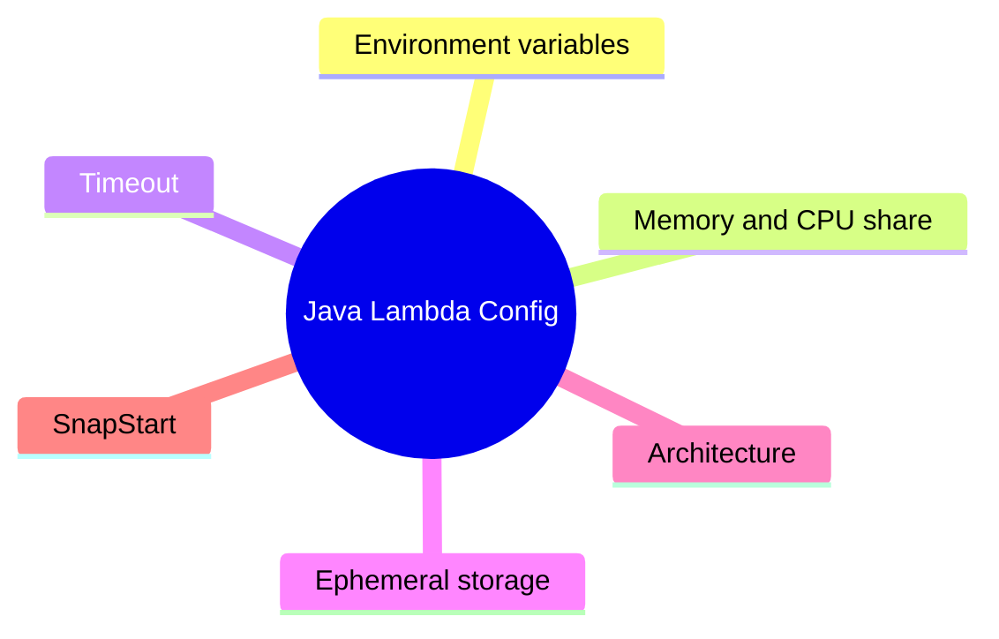

# Configuration for Java Lambda Functions

This tutorial covers the configuration settings that matter most for Java on Lambda: environment variables, memory, timeout, architecture, ephemeral storage, and SnapStart.
Treat configuration as part of the release contract so you can change runtime behavior without repackaging code.

## Key Configuration Areas



## Environment Variables

Store non-secret runtime settings in environment variables and resolve secrets from Secrets Manager or Parameter Store.

```yaml
Resources:
  JavaConfigFunction:
    Type: AWS::Serverless::Function
    Properties:
      CodeUri: .
      Handler: com.example.lambda.Handler::handleRequest
      Runtime: java21
      Environment:
        Variables:
          APP_ENV: prod
          ORDERS_TABLE: orders-prod
          LOG_LEVEL: INFO
```

Read them from Java:

```java
String appEnv = System.getenv("APP_ENV");
String ordersTable = System.getenv("ORDERS_TABLE");
```

## Memory and Timeout

Memory affects both available memory and CPU share, which matters for Java startup and JSON serialization work.
Start with 1024 MB or 1536 MB for general Java APIs, then tune with measured duration and cost data.

```yaml
Properties:
  MemorySize: 1536
  Timeout: 20
```

Update an existing function from the CLI:

```bash
aws lambda update-function-configuration \
  --function-name "$FUNCTION_NAME" \
  --memory-size 1536 \
  --timeout 20
```

## Ephemeral Storage

Increase ephemeral storage when your function downloads archives, stages ML assets, or writes larger temporary files.

```yaml
Properties:
  EphemeralStorage:
    Size: 1024
```

## Architecture

Choose `arm64` when supported libraries are available and you want better price-performance.
Choose `x86_64` if you depend on native libraries that do not ship arm64 builds.

```yaml
Properties:
  Architectures:
    - arm64
```

## SnapStart for Java

SnapStart creates a cached initialized snapshot of the function version and restores from that snapshot during startup.
It is useful when initialization work dominates cold-start time.

```yaml
Resources:
  JavaConfigFunction:
    Type: AWS::Serverless::Function
    Properties:
      AutoPublishAlias: live
      SnapStart:
        ApplyOn: PublishedVersions
```

When you enable SnapStart:

- Publish versions instead of invoking `$LATEST` directly.
- Avoid uniqueness assumptions during init code.
- Move request-specific values out of static initialization.
- Revalidate connections or credentials that should not be reused blindly after restore.

## Example Handler Configuration Pattern

```java
package com.example.lambda;

import com.amazonaws.services.lambda.runtime.Context;
import com.amazonaws.services.lambda.runtime.RequestHandler;
import java.util.Map;

public class Handler implements RequestHandler<Map<String, String>, Map<String, Object>> {
    private static final String APP_ENV = System.getenv().getOrDefault("APP_ENV", "dev");
    private static final int DEFAULT_LIMIT = Integer.parseInt(System.getenv().getOrDefault("DEFAULT_LIMIT", "25"));

    @Override
    public Map<String, Object> handleRequest(Map<String, String> event, Context context) {
        return Map.of(
            "environment", APP_ENV,
            "limit", DEFAULT_LIMIT,
            "requestId", context.getAwsRequestId()
        );
    }
}
```

## Safe Configuration Practices

- Keep secrets out of plain environment variables when rotation matters.
- Tune timeout to reflect upstream latency and retry behavior.
- Re-test performance after every memory change.
- Use aliases when rolling out config changes gradually.
- If SnapStart is enabled, test restore behavior, not only first init behavior.

!!! warning
    Environment variables are encrypted at rest, but they are still configuration values delivered to the function runtime.
    Do not treat them as a full secret-management substitute for rotating credentials.

## Verification

```bash
aws lambda get-function-configuration --function-name "$FUNCTION_NAME"
```

Confirm these fields in the output:

- `Environment.Variables`
- `MemorySize`
- `Timeout`
- `Architectures`
- `SnapStart`

## See Also

- [Deploy Your First Java Lambda Function](./02-first-deploy.md)
- [Logging and Monitoring for Java Lambda](./04-logging-monitoring.md)
- [Secrets Manager Recipe](./recipes/secrets-manager.md)
- [Java Runtime Reference](./java-runtime.md)

## Sources

- [Configuring Lambda function options](https://docs.aws.amazon.com/lambda/latest/dg/configuration-function-common.html)
- [Using environment variables with Lambda](https://docs.aws.amazon.com/lambda/latest/dg/configuration-envvars.html)
- [Improving startup performance with Lambda SnapStart](https://docs.aws.amazon.com/lambda/latest/dg/snapstart.html)
