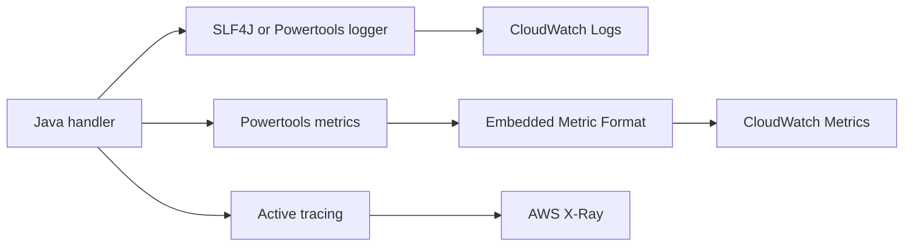

# Logging and Monitoring for Java Lambda

This tutorial adds structured logs, tracing, and metrics to a Java Lambda function.
The examples use SLF4J, Log4j2, Powertools for AWS Lambda (Java), and AWS X-Ray integration through Lambda tracing.

## Observability Flow



## Add Maven Dependencies

```xml
<dependencies>
    <dependency>
        <groupId>org.slf4j</groupId>
        <artifactId>slf4j-api</artifactId>
        <version>2.0.16</version>
    </dependency>
    <dependency>
        <groupId>org.apache.logging.log4j</groupId>
        <artifactId>log4j-slf4j2-impl</artifactId>
        <version>2.24.3</version>
    </dependency>
    <dependency>
        <groupId>software.amazon.lambda</groupId>
        <artifactId>powertools-logging</artifactId>
        <version>1.20.2</version>
    </dependency>
    <dependency>
        <groupId>software.amazon.lambda</groupId>
        <artifactId>powertools-metrics</artifactId>
        <version>1.20.2</version>
    </dependency>
</dependencies>
```

## Enable Tracing in SAM

```yaml
Resources:
  JavaObservedFunction:
    Type: AWS::Serverless::Function
    Properties:
      Runtime: java21
      Handler: com.example.lambda.ObservedHandler::handleRequest
      Tracing: Active
      Environment:
        Variables:
          POWERTOOLS_SERVICE_NAME: orders-api
          POWERTOOLS_METRICS_NAMESPACE: LambdaGuide
```

## Structured Logging Example

```java
package com.example.lambda;

import com.amazonaws.services.lambda.runtime.Context;
import com.amazonaws.services.lambda.runtime.RequestHandler;
import java.util.Map;
import org.slf4j.Logger;
import org.slf4j.LoggerFactory;
import software.amazon.lambda.powertools.logging.Logging;
import software.amazon.lambda.powertools.metrics.Metrics;
import software.amazon.lambda.powertools.metrics.MetricsFactory;
import software.amazon.lambda.powertools.metrics.model.MetricUnit;

public class ObservedHandler implements RequestHandler<Map<String, String>, Map<String, Object>> {
    private static final Logger logger = LoggerFactory.getLogger(ObservedHandler.class);
    private static final Metrics metrics = MetricsFactory.getMetricsInstance();

    @Override
    @Logging(logEvent = true)
    public Map<String, Object> handleRequest(Map<String, String> event, Context context) {
        String operation = event.getOrDefault("operation", "unknown");
        logger.info("Processing operation={}, requestId={}", operation, context.getAwsRequestId());

        metrics.addMetric("HandledRequests", 1, MetricUnit.COUNT);
        metrics.addDimension("Operation", operation);

        return Map.of("status", "ok", "operation", operation);
    }
}
```

## Minimal Log4j2 Configuration

Save this as `src/main/resources/log4j2.xml`.

```xml
<?xml version="1.0" encoding="UTF-8"?>
<Configuration status="WARN">
    <Appenders>
        <Console name="Console" target="SYSTEM_OUT">
            <PatternLayout pattern="%d %-5level %logger - %msg%n"/>
        </Console>
    </Appenders>
    <Loggers>
        <Root level="INFO">
            <AppenderRef ref="Console"/>
        </Root>
    </Loggers>
</Configuration>
```

## CloudWatch Logs Inspection

```bash
aws logs tail "/aws/lambda/$FUNCTION_NAME" --follow
```

Look for:

- Request IDs.
- Structured fields such as `operation`.
- `REPORT` lines with duration and memory usage.

## X-Ray Tracing

With `Tracing: Active`, Lambda emits trace segments that help you see downstream latency.
If the function calls AWS SDK v2 clients, X-Ray can show those calls as part of the service map when tracing is enabled for the workload.

## Monitoring Recommendations

- Alarm on `Errors`, `Throttles`, and `Duration` percentiles.
- Track `IteratorAge` for stream and queue consumers where relevant.
- Use Powertools metrics for business KPIs such as orders processed or validation failures.
- Correlate request IDs from logs with X-Ray traces during incident review.

!!! tip
    For Java functions, structured logs are especially useful because startup and dependency injection can add noise.
    Stable JSON-like fields make log queries much easier than parsing free-form text.

## Verification

```bash
aws lambda invoke \
  --function-name "$FUNCTION_NAME" \
  --cli-binary-format raw-in-base64-out \
  --payload '{"operation":"health-check"}' \
  response.json
aws logs tail "/aws/lambda/$FUNCTION_NAME" --follow
```

Confirm that logs, metrics, and traces appear after the invocation.

## See Also

- [Configuration for Java Lambda Functions](./03-configuration.md)
- [Infrastructure as Code for Java Lambda](./05-infrastructure-as-code.md)
- [Custom Metrics Recipe](./recipes/custom-metrics.md)
- [SQS Trigger Recipe](./recipes/sqs-trigger.md)

## Sources

- [Monitoring Lambda functions with CloudWatch](https://docs.aws.amazon.com/lambda/latest/dg/monitoring-functions.html)
- [Using AWS X-Ray with Lambda](https://docs.aws.amazon.com/lambda/latest/dg/services-xray.html)
- [Powertools for AWS Lambda (Java)](https://docs.aws.amazon.com/powertools/java/latest/)
