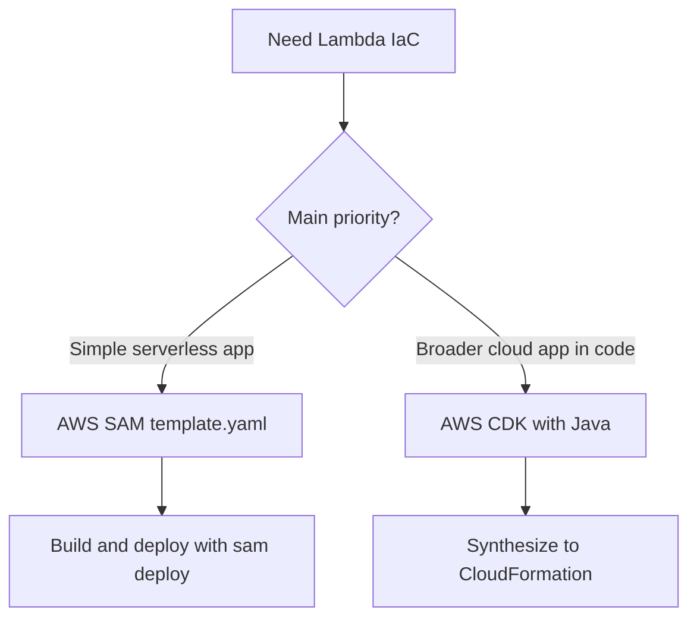

# Infrastructure as Code for Java Lambda

This tutorial compares two common infrastructure-as-code paths for Java Lambda workloads: AWS SAM and AWS CDK with Java.
Use SAM when you want concise serverless templates and use CDK when you want richer abstraction in a general-purpose language.

## IaC Decision Flow



## AWS SAM Template Example

```yaml
AWSTemplateFormatVersion: '2010-09-09'
Transform: AWS::Serverless-2016-10-31
Resources:
  OrdersFunction:
    Type: AWS::Serverless::Function
    Properties:
      FunctionName: orders-java
      CodeUri: .
      Handler: com.example.lambda.Handler::handleRequest
      Runtime: java21
      MemorySize: 1536
      Timeout: 20
      Tracing: Active
      Policies:
        - AWSLambdaBasicExecutionRole
      Events:
        OrdersApi:
          Type: Api
          Properties:
            Path: /orders
            Method: post
```

Deploy it with:

```bash
mvn clean package
sam build
sam deploy --stack-name "orders-java" --region "$REGION" --capabilities "CAPABILITY_IAM"
```

## AWS CDK with Java Example

Create a Maven-based CDK app and define the function in Java.

```xml
<dependency>
    <groupId>software.amazon.awscdk</groupId>
    <artifactId>aws-cdk-lib</artifactId>
    <version>2.177.0</version>
</dependency>
<dependency>
    <groupId>software.constructs</groupId>
    <artifactId>constructs</artifactId>
    <version>10.4.2</version>
</dependency>
```

```java
package com.example.infra;

import software.amazon.awscdk.Duration;
import software.amazon.awscdk.Stack;
import software.amazon.awscdk.StackProps;
import software.amazon.awscdk.services.lambda.Architecture;
import software.amazon.awscdk.services.lambda.Code;
import software.amazon.awscdk.services.lambda.Function;
import software.amazon.awscdk.services.lambda.Runtime;
import software.constructs.Construct;

public class LambdaGuideStack extends Stack {
    public LambdaGuideStack(Construct scope, String id, StackProps props) {
        super(scope, id, props);

        Function.Builder.create(this, "OrdersFunction")
            .functionName("orders-java")
            .runtime(Runtime.JAVA_21)
            .architecture(Architecture.X86_64)
            .handler("com.example.lambda.Handler::handleRequest")
            .memorySize(1536)
            .timeout(Duration.seconds(20))
            .code(Code.fromAsset("../app/target/function.zip"))
            .build();
    }
}
```

Deploy with CDK:

```bash
cdk bootstrap "aws://$ACCOUNT_ID/$REGION"
cdk deploy
```

## When to Prefer SAM

- You mainly deploy Lambda, API Gateway, queues, and event sources.
- You want first-class `sam build`, `sam local invoke`, and serverless packaging shortcuts.
- You prefer concise YAML for docs and examples.

## When to Prefer CDK

- You want reusable constructs and richer code abstraction.
- Your app includes many non-serverless resources.
- Your team already uses Java for application and infrastructure code.

## Packaging Note

Whether you use SAM or CDK, the Java build artifact still comes from Maven.
Keep the application packaging step independent and let the IaC layer reference the artifact path.

!!! note
    CDK synthesizes CloudFormation templates.
    SAM also expands into CloudFormation, but with serverless-specific transforms and local tooling built around Lambda workflows.

## Verification

- `sam validate` succeeds for the SAM template.
- `cdk synth` succeeds for the CDK app.
- The deployed stack creates the expected function name, memory, timeout, and triggers.

## See Also

- [Deploy Your First Java Lambda Function](./02-first-deploy.md)
- [CI/CD for Java Lambda](./06-ci-cd.md)
- [Layers Recipe](./recipes/layers.md)
- [Docker Image Recipe](./recipes/docker-image.md)

## Sources

- [What is AWS SAM](https://docs.aws.amazon.com/serverless-application-model/latest/developerguide/what-is-sam.html)
- [AWS SAM template fundamentals](https://docs.aws.amazon.com/serverless-application-model/latest/developerguide/sam-specification-template-anatomy.html)
- [AWS CDK Developer Guide](https://docs.aws.amazon.com/cdk/v2/guide/home.html)
