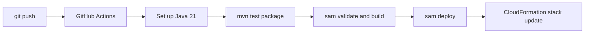

# CI/CD for Java Lambda

This tutorial creates a GitHub Actions pipeline for Java Lambda that builds with Maven, validates the SAM template, and deploys with AWS SAM.
The pipeline assumes AWS credentials are provided through GitHub OIDC or repository secrets.

## Pipeline Stages



## Recommended Repository Layout

```text
.
├── .github/workflows/java-lambda.yml
├── pom.xml
├── template.yaml
└── src/main/java/com/example/lambda/
```

## GitHub Actions Workflow

```yaml
name: java-lambda

on:
  push:
    branches:
      - main
  pull_request:

jobs:
  build-and-deploy:
    runs-on: ubuntu-latest
    permissions:
      id-token: write
      contents: read
    env:
      AWS_REGION: ap-northeast-2
      STACK_NAME: java-lambda-guide
    steps:
      - name: Check out source
        uses: actions/checkout@v4

      - name: Set up Java
        uses: actions/setup-java@v4
        with:
          distribution: temurin
          java-version: '21'
          cache: maven

      - name: Set up AWS SAM CLI
        uses: aws-actions/setup-sam@v2

      - name: Configure AWS credentials
        uses: aws-actions/configure-aws-credentials@v4
        with:
          role-to-assume: arn:aws:iam::<account-id>:role/github-actions-deploy
          aws-region: ${{ env.AWS_REGION }}

      - name: Build with Maven
        run: mvn --batch-mode clean verify package

      - name: Validate SAM template
        run: sam validate

      - name: Build SAM application
        run: sam build

      - name: Deploy stack
        if: github.ref == 'refs/heads/main'
        run: >-
          sam deploy
          --stack-name "$STACK_NAME"
          --region "$REGION"
          --capabilities "CAPABILITY_IAM"
          --no-confirm-changeset
          --no-fail-on-empty-changeset
```

## Maven Build Expectations

Your `pom.xml` should at least support compile, test, and package stages.
For Lambda ZIP packaging, keep a shade or assembly step so the artifact is deployment-ready.

```xml
<build>
    <plugins>
        <plugin>
            <groupId>org.apache.maven.plugins</groupId>
            <artifactId>maven-surefire-plugin</artifactId>
            <version>3.5.2</version>
        </plugin>
        <plugin>
            <groupId>org.apache.maven.plugins</groupId>
            <artifactId>maven-shade-plugin</artifactId>
            <version>3.5.2</version>
            <executions>
                <execution>
                    <phase>package</phase>
                    <goals>
                        <goal>shade</goal>
                    </goals>
                </execution>
            </executions>
        </plugin>
    </plugins>
</build>
```

## Recommended Promotion Pattern

- Pull requests: run tests, `sam validate`, and `sam build` only.
- Main branch: deploy to a development or shared integration stack.
- Tagged release or protected branch: deploy to production with approvals.

## Security Notes

- Prefer GitHub OIDC with `role-to-assume` instead of long-lived access keys.
- Restrict the IAM role trust policy to the repository and branch conditions you expect.
- Keep stack names and regions in workflow or environment configuration, not embedded in source code.

!!! tip
    If you deploy aliases or versions, add post-deploy smoke tests that invoke the alias rather than `$LATEST`.
    That keeps the CI/CD verification path aligned with production traffic.

## Verification

Confirm that the workflow does all of the following:

- Restores Maven dependencies from cache.
- Builds successfully on Java 21.
- Validates `template.yaml`.
- Deploys only on the intended branch.
- Leaves the CloudFormation stack in `UPDATE_COMPLETE` or `CREATE_COMPLETE`.

## See Also

- [Infrastructure as Code for Java Lambda](./05-infrastructure-as-code.md)
- [Custom Domain and SSL for Java APIs](./07-custom-domain-ssl.md)
- [Configuration for Java Lambda Functions](./03-configuration.md)
- [Java Recipes](./recipes/index.md)

## Sources

- [Deploying serverless applications with GitHub Actions and AWS SAM](https://docs.aws.amazon.com/serverless-application-model/latest/developerguide/deploying-using-github.html)
- [Configure AWS credentials for GitHub Actions](https://docs.aws.amazon.com/lambda/latest/dg/deploying-github-actions.html)
- [Using IAM roles for GitHub OIDC federation](https://docs.aws.amazon.com/IAM/latest/UserGuide/id_roles_providers_create_oidc.html)
