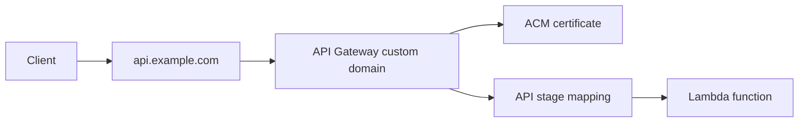

# Custom Domain and SSL for Java APIs

This tutorial connects a Java Lambda API behind API Gateway to a custom domain secured by AWS Certificate Manager (ACM).
The Lambda code does not change much; the main work is in API Gateway, ACM, Route 53, and DNS validation.

## Architecture



## Prerequisites

- A Lambda-backed API already deployed through API Gateway.
- A registered domain name.
- Permission to request ACM certificates and manage Route 53 or external DNS records.

## Request the Certificate

For Regional API Gateway custom domains, request the certificate in the same Region as the API.

```bash
aws acm request-certificate \
  --domain-name "api.example.com" \
  --validation-method "DNS" \
  --region "$REGION"
```

After the request, create the DNS validation record shown by ACM.

## SAM Template for API and Domain

```yaml
Resources:
  HttpApi:
    Type: AWS::Serverless::HttpApi
    Properties:
      StageName: prod
      Domain:
        DomainName: api.example.com
        CertificateArn: arn:aws:acm:$REGION:<account-id>:certificate/xxxxxxxx-xxxx-xxxx-xxxx-xxxxxxxxxxxx
        Route53:
          HostedZoneId: Z1234567890ABC

  ApiFunction:
    Type: AWS::Serverless::Function
    Properties:
      Runtime: java21
      Handler: com.example.lambda.ApiHandler::handleRequest
      CodeUri: .
      Events:
        ApiEvent:
          Type: HttpApi
          Properties:
            ApiId: !Ref HttpApi
            Path: /hello
            Method: GET
```

## API Handler Example

```java
package com.example.lambda;

import com.amazonaws.services.lambda.runtime.Context;
import com.amazonaws.services.lambda.runtime.RequestHandler;
import com.amazonaws.services.lambda.runtime.events.APIGatewayProxyRequestEvent;
import com.amazonaws.services.lambda.runtime.events.APIGatewayProxyResponseEvent;
import java.util.Map;

public class ApiHandler implements RequestHandler<APIGatewayProxyRequestEvent, APIGatewayProxyResponseEvent> {
    @Override
    public APIGatewayProxyResponseEvent handleRequest(APIGatewayProxyRequestEvent event, Context context) {
        return new APIGatewayProxyResponseEvent()
            .withStatusCode(200)
            .withHeaders(Map.of("Content-Type", "application/json"))
            .withBody("{\"message\":\"hello from java\"}");
    }
}
```

## Manual API Gateway CLI Path

If the API already exists, create the domain and API mapping separately.

```bash
aws apigatewayv2 create-domain-name \
  --domain-name "api.example.com" \
  --domain-name-configurations CertificateArn="arn:aws:acm:$REGION:<account-id>:certificate/xxxxxxxx-xxxx-xxxx-xxxx-xxxxxxxxxxxx"

aws apigatewayv2 create-api-mapping \
  --domain-name "api.example.com" \
  --api-id "$API_ID" \
  --stage "prod"
```

Then point your DNS record to the target domain name returned by API Gateway.

## Operational Notes

- Regional custom domains are the standard choice for Regional APIs.
- DNS validation is easier to automate than email validation.
- Certificate renewal is managed by ACM for issued public certificates, but only while validation remains intact.
- Keep API stage mappings explicit so changes are predictable.

!!! note
    The custom domain terminates TLS at API Gateway.
    Your Lambda function still receives normal API Gateway event payloads and does not manage certificates directly.

## Verification

```bash
curl --verbose "https://api.example.com/hello"
```

Confirm that:

- TLS certificate matches the custom hostname.
- The request returns the API response from Lambda.
- API Gateway access and execution logs show successful routing.

## See Also

- [Deploy Your First Java Lambda Function](./02-first-deploy.md)
- [Infrastructure as Code for Java Lambda](./05-infrastructure-as-code.md)
- [REST API Gateway Recipe](./recipes/api-gateway-rest.md)
- [Java Recipes](./recipes/index.md)

## Sources

- [Custom domain names for HTTP APIs in API Gateway](https://docs.aws.amazon.com/apigateway/latest/developerguide/http-api-custom-domain-names.html)
- [AWS Certificate Manager DNS validation](https://docs.aws.amazon.com/acm/latest/userguide/dns-validation.html)
- [AWS SAM HttpApi domain configuration](https://docs.aws.amazon.com/serverless-application-model/latest/developerguide/sam-property-httpapi-httpapidomainconfiguration.html)
