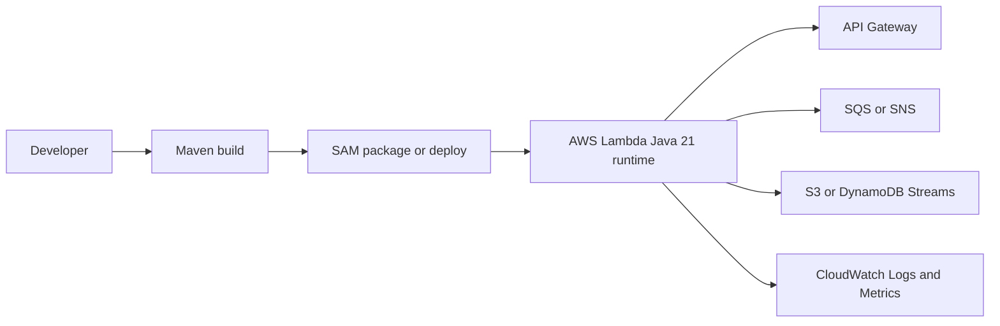

# Java on AWS Lambda

This guide shows how to build, package, deploy, and operate Java functions on AWS Lambda with Maven, AWS SAM, and the AWS SDK for Java 2.x.
The default examples target Java 21 and focus on request-driven functions that are easy to extend into API, queue, stream, and scheduled workloads.

## Why Java on Lambda

- Strong type safety for larger event contracts.
- Mature build tooling with Maven and reusable dependency management.
- Good fit for AWS SDK v2, Powertools for AWS Lambda (Java), and enterprise libraries.
- SnapStart support for reducing cold-start latency on supported Java runtimes.

## What You'll Build

Across this track, you will build and evolve a Lambda application that:

- Uses a `RequestHandler` implementation for clear event and response types.
- Builds with Maven into a deployment ZIP or container image.
- Deploys with AWS SAM and optionally with raw AWS CLI commands.
- Adds environment variables, memory, timeout, logging, tracing, and custom metrics.
- Integrates with API Gateway, SQS, SNS, S3, DynamoDB Streams, Secrets Manager, RDS Proxy, and layers.



## Prerequisites

- AWS account and IAM permissions for Lambda, IAM, CloudFormation, API Gateway, and CloudWatch.
- Java 21 installed locally.
- Maven 3.9 or later.
- AWS CLI configured with `aws configure`.
- AWS SAM CLI installed for local invoke and deployment workflows.
- Docker installed if you want to use `sam local invoke` or container image recipes.

## Recommended Project Layout

```text
.
├── pom.xml
├── template.yaml
├── src/
│   └── main/
│       └── java/com/example/lambda/
│           ├── Handler.java
│           └── model/
└── events/
    └── event.json
```

## Learning Path

1. Start with [Run Locally](./01-local-run.md) to make sure the build and handler contract work.
2. Continue with [First Deploy](./02-first-deploy.md) to publish a working function.
3. Add operational settings in [Configuration](./03-configuration.md).
4. Add observability in [Logging and Monitoring](./04-logging-monitoring.md).
5. Choose an IaC workflow in [Infrastructure as Code](./05-infrastructure-as-code.md).
6. Automate releases in [CI/CD](./06-ci-cd.md).
7. Front the function with HTTPS in [Custom Domain and SSL](./07-custom-domain-ssl.md).
8. Use [Java Runtime Reference](./java-runtime.md) when you need runtime-specific packaging or handler details.
9. Expand with focused examples in [Java Recipes](./recipes/index.md).

## Core Dependencies

The examples in this track commonly use these Maven artifacts:

```xml
<dependencies>
    <dependency>
        <groupId>com.amazonaws</groupId>
        <artifactId>aws-lambda-java-core</artifactId>
        <version>1.2.3</version>
    </dependency>
    <dependency>
        <groupId>com.amazonaws</groupId>
        <artifactId>aws-lambda-java-events</artifactId>
        <version>3.14.0</version>
    </dependency>
    <dependency>
        <groupId>software.amazon.awssdk</groupId>
        <artifactId>lambda</artifactId>
        <version>2.30.35</version>
    </dependency>
</dependencies>
```

## Delivery Models Covered

- ZIP deployment with Maven build output and a SAM template.
- Raw AWS CLI deployment with `aws lambda create-function` and `aws lambda update-function-code`.
- Container image deployment for functions that benefit from custom base images or larger dependency sets.

## Verification Checklist

Before moving past the tutorial track, verify that you can:

- Build the project with `mvn clean package`.
- Run the handler locally with `sam local invoke`.
- Deploy a stack with `sam deploy`.
- Inspect logs with `aws logs tail`.
- Update configuration without changing code.

## See Also

- [Run a Java Lambda Function Locally](./01-local-run.md)
- [Deploy Your First Java Lambda Function](./02-first-deploy.md)
- [Java Runtime Reference](./java-runtime.md)
- [Java Recipes](./recipes/index.md)

## Sources

- [AWS Lambda Java handler documentation](https://docs.aws.amazon.com/lambda/latest/dg/java-handler.html)
- [AWS Lambda runtimes](https://docs.aws.amazon.com/lambda/latest/dg/lambda-runtimes.html)
- [Using AWS SAM CLI with AWS Lambda](https://docs.aws.amazon.com/serverless-application-model/latest/developerguide/what-is-sam.html)
