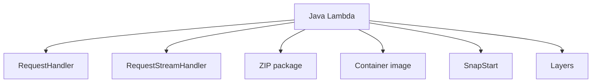

# Java Runtime Reference for AWS Lambda

This reference summarizes the Java runtime choices and handler patterns that matter when you package Java functions for Lambda.
Use it when you need a quick decision guide for handler type, runtime version, packaging model, or SnapStart behavior.

## Runtime Overview



## Supported Managed Runtimes

At the time of writing, Lambda supports managed Java runtimes for:

- Java 11
- Java 17
- Java 21

For new projects in this guide, Java 21 is the default recommendation unless a dependency or platform policy requires an older LTS runtime.

## `RequestHandler` vs `RequestStreamHandler`

### `RequestHandler`

Use `RequestHandler<I, O>` when:

- The event shape maps cleanly to a Java type.
- You want simpler code and easier tests.
- You use event classes from `aws-lambda-java-events`.

```java
public class Handler implements RequestHandler<Map<String, String>, Map<String, Object>> {
    @Override
    public Map<String, Object> handleRequest(Map<String, String> event, Context context) {
        return Map.of("ok", true);
    }
}
```

### `RequestStreamHandler`

Use `RequestStreamHandler` when:

- You want to stream input and output manually.
- You need custom JSON parsing or a lower-level contract.
- You want tighter control over large payload handling.

```java
public class StreamHandler implements RequestStreamHandler {
    @Override
    public void handleRequest(InputStream input, OutputStream output, Context context) throws IOException {
        output.write("{\"ok\":true}".getBytes(StandardCharsets.UTF_8));
    }
}
```

## The `Context` Object

The Lambda `Context` object exposes runtime metadata such as:

- AWS request ID.
- Function name and version.
- Remaining execution time.
- CloudWatch Logs group and stream names.
- Built-in logger.

Common usage pattern:

```java
String requestId = context.getAwsRequestId();
int millisRemaining = context.getRemainingTimeInMillis();
```

## Maven and Gradle Packaging

Maven is the default build tool in this guide.
The usual ZIP deployment pattern is a shaded or assembled JAR that becomes the function package.

Minimal Maven snippet:

```xml
<plugin>
    <groupId>org.apache.maven.plugins</groupId>
    <artifactId>maven-shade-plugin</artifactId>
    <version>3.5.2</version>
    <executions>
        <execution>
            <phase>package</phase>
            <goals>
                <goal>shade</goal>
            </goals>
        </execution>
    </executions>
</plugin>
```

Gradle is also supported by Lambda, but it is outside the main path for this Java guide.

## Uber-JAR vs Layers

### Uber-JAR

- Simpler deployment artifact.
- Easy for smaller applications.
- Best when dependencies change together with application code.

### Layers

- Useful for shared libraries across multiple functions.
- Can reduce repeated packaging across many functions.
- Adds version management and deployment coordination.

Use layers for shared SDK wrappers, observability utilities, or internal libraries, not as a default for every project.

## SnapStart Notes

SnapStart is available for supported Java managed runtimes when you publish versions.
It snapshots the initialized execution environment and restores from that cached state to reduce startup time.

Key implications:

- Initialize expensive clients and configuration before snapshot creation when safe.
- Avoid generating uniqueness-sensitive values during init.
- Validate connection lifecycles after restore.
- Use aliases and versions so production traffic targets published versions.

## Handler String Format

For Java managed runtimes, the handler value typically uses this format:

```text
com.example.lambda.Handler::handleRequest
```

That must match the package, class name, and method signature exactly.

## Event Type Libraries

Use `aws-lambda-java-events` for typed event classes such as:

- `APIGatewayProxyRequestEvent`
- `SQSEvent`
- `SNSEvent`
- `S3Event`
- `DynamodbEvent`

These reduce manual JSON parsing and make handler signatures easier to read.

## Decision Guide

- Start with `RequestHandler`.
- Use Java 21 for new applications.
- Package as a shaded JAR unless you have a clear reason to split layers.
- Evaluate SnapStart for APIs or interactive workloads affected by startup latency.
- Use container images when you need custom OS-level content or image-based workflows.

## See Also

- [Run a Java Lambda Function Locally](./01-local-run.md)
- [Configuration for Java Lambda Functions](./03-configuration.md)
- [Layers Recipe](./recipes/layers.md)
- [Docker Image Recipe](./recipes/docker-image.md)

## Sources

- [AWS Lambda Java programming model](https://docs.aws.amazon.com/lambda/latest/dg/lambda-java.html)
- [Java handler interfaces for Lambda](https://docs.aws.amazon.com/lambda/latest/dg/java-handler.html)
- [Lambda SnapStart documentation](https://docs.aws.amazon.com/lambda/latest/dg/snapstart.html)
- [Deploy Java Lambda functions with container images](https://docs.aws.amazon.com/lambda/latest/dg/java-image.html)
