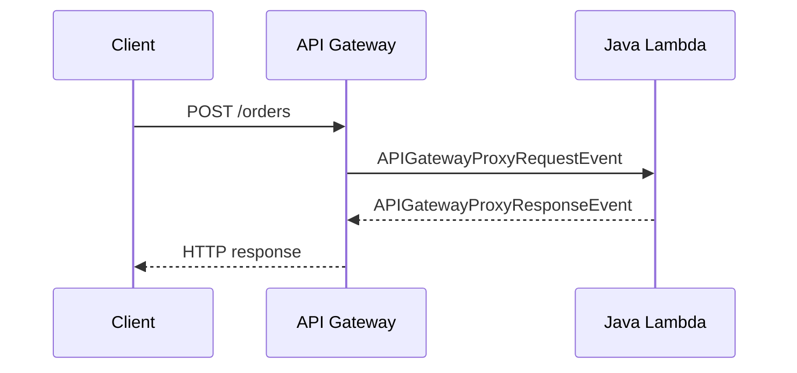

# Java Recipe: API Gateway REST

Use this pattern when Lambda sits behind API Gateway REST API or proxy-style integrations and you want typed request and response classes.
The handler uses `APIGatewayProxyRequestEvent` and `APIGatewayProxyResponseEvent` from `aws-lambda-java-events`.

## Request Flow



## Maven Dependencies

```xml
<dependency>
    <groupId>com.amazonaws</groupId>
    <artifactId>aws-lambda-java-events</artifactId>
    <version>3.14.0</version>
</dependency>
```

## Handler Example

```java
package com.example.lambda;

import com.amazonaws.services.lambda.runtime.Context;
import com.amazonaws.services.lambda.runtime.RequestHandler;
import com.amazonaws.services.lambda.runtime.events.APIGatewayProxyRequestEvent;
import com.amazonaws.services.lambda.runtime.events.APIGatewayProxyResponseEvent;
import java.util.Map;

public class RestHandler implements RequestHandler<APIGatewayProxyRequestEvent, APIGatewayProxyResponseEvent> {
    @Override
    public APIGatewayProxyResponseEvent handleRequest(APIGatewayProxyRequestEvent event, Context context) {
        String requestBody = event.getBody();
        String requestId = context.getAwsRequestId();

        return new APIGatewayProxyResponseEvent()
            .withStatusCode(200)
            .withHeaders(Map.of("Content-Type", "application/json"))
            .withBody("{\"status\":\"accepted\",\"requestId\":\"" + requestId + "\"}");
    }
}
```

## SAM Template Snippet

```yaml
Resources:
  RestApiFunction:
    Type: AWS::Serverless::Function
    Properties:
      Runtime: java21
      CodeUri: .
      Handler: com.example.lambda.RestHandler::handleRequest
      Events:
        OrdersApi:
          Type: Api
          Properties:
            Path: /orders
            Method: post
```

## Event Details to Watch

- `getPathParameters()` for route variables.
- `getQueryStringParameters()` for filters and paging.
- `getHeaders()` for authentication context and content type.
- `getIsBase64Encoded()` for binary payload handling.

## Local Test Event Example

```json
{
  "resource": "/orders",
  "path": "/orders",
  "httpMethod": "POST",
  "headers": {
    "content-type": "application/json"
  },
  "body": "{\"orderId\":\"123\"}",
  "isBase64Encoded": false
}
```

Invoke locally:

```bash
sam local invoke "RestApiFunction" --event "events/api-request.json"
```

## Good Practices

- Always set a `Content-Type` response header.
- Return explicit status codes rather than relying on defaults.
- Validate request bodies before calling downstream services.
- Keep the handler thin and move business logic into plain Java classes.

!!! tip
    For new HTTP APIs, compare REST API and HTTP API features before standardizing.
    This recipe uses REST-style event objects because they remain common in existing Lambda integrations.

## Verification

- The handler returns valid JSON in the body.
- API Gateway forwards headers and body as expected.
- Status codes are preserved end to end.

## See Also

- [Custom Domain and SSL for Java APIs](../07-custom-domain-ssl.md)
- [Run a Java Lambda Function Locally](../01-local-run.md)
- [SQS Trigger Recipe](./sqs-trigger.md)
- [Java Recipes](./index.md)

## Sources

- [Using Lambda proxy integrations with API Gateway](https://docs.aws.amazon.com/apigateway/latest/developerguide/set-up-lambda-proxy-integrations.html)
- [Sample event objects for Lambda](https://docs.aws.amazon.com/lambda/latest/dg/with-on-demand-https.html)
