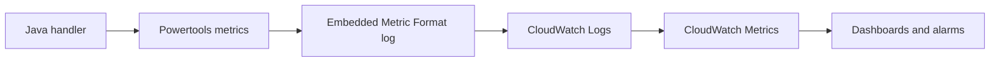

# Java Recipe: Custom CloudWatch Metrics

Use this pattern when you need business or workflow metrics in addition to Lambda's built-in service metrics.
For Java Lambda functions, Powertools metrics and Embedded Metric Format are the simplest ways to publish structured custom measurements.

## Metric Flow



## Maven Dependency

```xml
<dependency>
    <groupId>software.amazon.lambda</groupId>
    <artifactId>powertools-metrics</artifactId>
    <version>1.20.2</version>
</dependency>
```

## Handler Example

```java
package com.example.lambda;

import com.amazonaws.services.lambda.runtime.Context;
import com.amazonaws.services.lambda.runtime.RequestHandler;
import java.util.Map;
import software.amazon.lambda.powertools.metrics.Metrics;
import software.amazon.lambda.powertools.metrics.MetricsFactory;
import software.amazon.lambda.powertools.metrics.model.MetricUnit;

public class MetricsHandler implements RequestHandler<Map<String, String>, Map<String, Object>> {
    private static final Metrics metrics = MetricsFactory.getMetricsInstance();

    @Override
    public Map<String, Object> handleRequest(Map<String, String> event, Context context) {
        String outcome = event.getOrDefault("outcome", "success");

        metrics.addDimension("Service", "orders-api");
        metrics.addMetric("RequestsProcessed", 1, MetricUnit.COUNT);

        if ("failure".equals(outcome)) {
            metrics.addMetric("ValidationFailures", 1, MetricUnit.COUNT);
        }

        return Map.of("outcome", outcome);
    }
}
```

## SAM Template Snippet

```yaml
Resources:
  MetricsFunction:
    Type: AWS::Serverless::Function
    Properties:
      Runtime: java21
      Handler: com.example.lambda.MetricsHandler::handleRequest
      CodeUri: .
      Environment:
        Variables:
          POWERTOOLS_SERVICE_NAME: orders-api
          POWERTOOLS_METRICS_NAMESPACE: LambdaGuide
```

## Metric Design Tips

- Keep namespaces stable across environments.
- Use low-cardinality dimensions such as service, operation, or environment.
- Avoid request IDs or user IDs as dimensions.
- Alarm on rates or thresholds that map to customer impact.

## Typical Custom Metrics

- Orders accepted.
- Validation failures.
- Third-party timeout count.
- Records processed per batch.
- Items skipped due to idempotency.

## Verification

```bash
aws lambda invoke \
  --function-name "$FUNCTION_NAME" \
  --cli-binary-format raw-in-base64-out \
  --payload '{"outcome":"failure"}' \
  response.json
```

After invocation, verify that the custom namespace and metric names appear in CloudWatch.

!!! note
    Embedded Metric Format writes metrics through logs.
    That means the function role still needs normal CloudWatch Logs permissions even when your goal is custom metrics.

## See Also

- [Logging and Monitoring for Java Lambda](../04-logging-monitoring.md)
- [SQS Trigger Recipe](./sqs-trigger.md)
- [SNS Trigger Recipe](./sns-trigger.md)
- [Java Recipes](./index.md)

## Sources

- [Monitoring Lambda metrics with CloudWatch](https://docs.aws.amazon.com/lambda/latest/dg/monitoring-metrics.html)
- [Powertools for AWS Lambda (Java) metrics utility](https://docs.aws.amazon.com/powertools/java/latest/core/metrics/)
