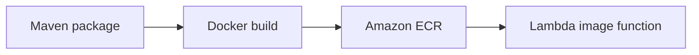

# Java Recipe: Lambda Container Image

Use this pattern when you want to package a Java Lambda function as a container image instead of a ZIP archive.
Container images are useful when you need image-based supply-chain workflows, custom system libraries, or larger packaged assets.

## Packaging Flow



## Dockerfile Example

Use the AWS Lambda Java base image and copy in the shaded application JAR.

```dockerfile
FROM public.ecr.aws/lambda/java:21

COPY target/java-lambda-guide-1.0.0.jar ${LAMBDA_TASK_ROOT}/lib/

CMD ["com.example.lambda.Handler::handleRequest"]
```

## Maven Packaging Requirement

Your `pom.xml` still needs to build the application artifact before Docker assembles the image.

```xml
<plugin>
    <groupId>org.apache.maven.plugins</groupId>
    <artifactId>maven-shade-plugin</artifactId>
    <version>3.5.2</version>
    <executions>
        <execution>
            <phase>package</phase>
            <goals>
                <goal>shade</goal>
            </goals>
        </execution>
    </executions>
</plugin>
```

## Build and Push the Image

```bash
export REPOSITORY_NAME="java-lambda-guide"
export IMAGE_TAG="2026-04-07"

mvn clean package
aws ecr create-repository --repository-name "$REPOSITORY_NAME"
aws ecr get-login-password --region "$REGION" | docker login --username AWS --password-stdin "$ACCOUNT_ID.dkr.ecr.$REGION.amazonaws.com"
docker build --tag "$REPOSITORY_NAME:$IMAGE_TAG" .
docker tag "$REPOSITORY_NAME:$IMAGE_TAG" "$ACCOUNT_ID.dkr.ecr.$REGION.amazonaws.com/$REPOSITORY_NAME:$IMAGE_TAG"
docker push "$ACCOUNT_ID.dkr.ecr.$REGION.amazonaws.com/$REPOSITORY_NAME:$IMAGE_TAG"
```

When documenting account-specific paths, replace the real account number with `<account-id>`.

## Create the Image-Based Function

```bash
aws lambda create-function \
  --function-name "$FUNCTION_NAME" \
  --package-type "Image" \
  --code ImageUri="$ACCOUNT_ID.dkr.ecr.$REGION.amazonaws.com/$REPOSITORY_NAME:$IMAGE_TAG" \
  --role "$ROLE_ARN"
```

## SAM Template Alternative

```yaml
Resources:
  ImageFunction:
    Type: AWS::Serverless::Function
    Properties:
      PackageType: Image
      MemorySize: 1536
      Timeout: 20
    Metadata:
      Dockerfile: Dockerfile
      DockerContext: .
      DockerTag: java21-v1
```

## When Image Packaging Fits

- You need a custom OS-level dependency.
- Your platform team already manages container image scanning and promotion.
- A ZIP package is too limiting for the artifact structure.

## Trade-Offs

- Container images can be larger and slower to push.
- You still must manage handler, runtime, and dependency compatibility.
- Operationally, ECR becomes part of the release path.

!!! tip
    Use container images intentionally, not automatically.
    For many Java Lambda functions, a shaded JAR ZIP is still the simplest and fastest delivery model.

## Verification

- The image builds locally.
- The ECR push succeeds.
- Lambda creates or updates the image-based function successfully.
- Invocations use the expected handler in the image.

## See Also

- [Infrastructure as Code for Java Lambda](../05-infrastructure-as-code.md)
- [Java Runtime Reference](../java-runtime.md)
- [Layers Recipe](./layers.md)
- [Java Recipes](./index.md)

## Sources

- [Deploy Java Lambda functions with container images](https://docs.aws.amazon.com/lambda/latest/dg/java-image.html)
- [Create a Lambda function using a container image](https://docs.aws.amazon.com/lambda/latest/dg/images-create.html)
- [Amazon ECR getting started](https://docs.aws.amazon.com/AmazonECR/latest/userguide/getting-started-cli.html)
