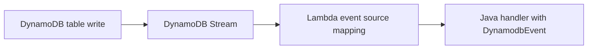

# Java Recipe: DynamoDB Streams

Use this pattern when item changes in DynamoDB should trigger Lambda processing.
The handler consumes a `DynamodbEvent` batch and processes one or more stream records produced by table updates.

## Event Flow



## Maven Dependency

```xml
<dependency>
    <groupId>com.amazonaws</groupId>
    <artifactId>aws-lambda-java-events</artifactId>
    <version>3.14.0</version>
</dependency>
```

## Handler Example

```java
package com.example.lambda;

import com.amazonaws.services.lambda.runtime.Context;
import com.amazonaws.services.lambda.runtime.RequestHandler;
import com.amazonaws.services.lambda.runtime.events.DynamodbEvent;

public class StreamHandler implements RequestHandler<DynamodbEvent, Void> {
    @Override
    public Void handleRequest(DynamodbEvent event, Context context) {
        for (DynamodbEvent.DynamodbStreamRecord record : event.getRecords()) {
            String eventName = record.getEventName();
            String keys = String.valueOf(record.getDynamodb().getKeys());
            context.getLogger().log("eventName=" + eventName + ", keys=" + keys);
        }
        return null;
    }
}
```

## SAM Template Snippet

```yaml
Resources:
  StreamProcessorFunction:
    Type: AWS::Serverless::Function
    Properties:
      Runtime: java21
      Handler: com.example.lambda.StreamHandler::handleRequest
      CodeUri: .
      Policies:
        - AWSLambdaDynamoDBExecutionRole
      Events:
        OrdersStream:
          Type: DynamoDB
          Properties:
            Stream: arn:aws:dynamodb:$REGION:<account-id>:table/orders/stream/2026-04-07T00:00:00.000
            StartingPosition: LATEST
            BatchSize: 100
            MaximumRetryAttempts: 3
```

## Record Handling Notes

- `INSERT`, `MODIFY`, and `REMOVE` are the common event names.
- `NewImage` and `OldImage` are available depending on stream view type.
- The stream record order is preserved per shard, not across the whole table.

## Common Processing Pattern

1. Read the record event name.
2. Extract keys and changed attributes.
3. Apply idempotent business logic.
4. Fail only for truly retryable errors.

## Operational Guidance

- Keep processing idempotent because retries happen.
- Monitor iterator age to catch consumer lag.
- Use dead-letter or failure handling where the broader workflow requires durable error capture.

!!! note
    Event source mappings batch records and manage polling for you.
    Your code handles records, while Lambda manages stream reads, checkpointing, and retries.

## Verification

- Stream is enabled on the DynamoDB table.
- The function receives the expected event names.
- Logs show keys or images for modified items.
- Iterator age remains healthy under normal load.

## See Also

- [Configuration for Java Lambda Functions](../03-configuration.md)
- [Logging and Monitoring for Java Lambda](../04-logging-monitoring.md)
- [SQS Trigger Recipe](./sqs-trigger.md)
- [Java Recipes](./index.md)

## Sources

- [Using AWS Lambda with Amazon DynamoDB](https://docs.aws.amazon.com/lambda/latest/dg/with-ddb.html)
- [DynamoDB Streams and Lambda event source mappings](https://docs.aws.amazon.com/amazondynamodb/latest/developerguide/Streams.Lambda.html)
