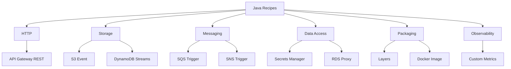

# Java Lambda Recipes

This catalog groups focused Java examples for common Lambda integration patterns.
Each recipe assumes Java 21, Maven packaging, AWS SDK for Java 2.x, and event types from `aws-lambda-java-events` where applicable.

## Recipe Map



## Available Recipes

| Recipe | Use it when | Main Java Type |
|---|---|---|
| [API Gateway REST](./api-gateway-rest.md) | You need REST-style request and response mapping | `APIGatewayProxyRequestEvent` |
| [DynamoDB Streams](./dynamodb-streams.md) | You react to table item changes | `DynamodbEvent` |
| [S3 Event](./s3-event.md) | You process uploads or object changes | `S3Event` |
| [SQS Trigger](./sqs-trigger.md) | You consume batched queue messages | `SQSEvent` |
| [SNS Trigger](./sns-trigger.md) | You handle fan-out notifications | `SNSEvent` |
| [Secrets Manager](./secrets-manager.md) | You load rotating secrets at runtime | `SecretsManagerClient` |
| [RDS Proxy](./rds-proxy.md) | You connect Lambda to relational databases | JDBC + RDS Proxy |
| [Layers](./layers.md) | You share Java libraries across functions | Lambda layer |
| [Custom Metrics](./custom-metrics.md) | You emit business KPIs | CloudWatch metrics |
| [Docker Image](./docker-image.md) | You deploy with container images | Lambda base image |

## How to Use the Recipes

- Start from the handler signature and event type.
- Add the Maven dependencies shown in the recipe.
- Copy the SAM snippet for the trigger or packaging model.
- Test locally where supported, then deploy to AWS.
- Add alarms and logs before moving the pattern into production.

## Shared Assumptions

Most recipes assume a project layout like this:

```text
.
├── pom.xml
├── template.yaml
└── src/main/java/com/example/lambda/
```

Many recipes also assume this base dependency set:

```xml
<dependency>
    <groupId>com.amazonaws</groupId>
    <artifactId>aws-lambda-java-core</artifactId>
    <version>1.2.3</version>
</dependency>
<dependency>
    <groupId>com.amazonaws</groupId>
    <artifactId>aws-lambda-java-events</artifactId>
    <version>3.14.0</version>
</dependency>
```

## Choosing the Right Pattern

- Use synchronous request-response recipes for API Gateway.
- Use batched event recipes for queues and streams.
- Use Secrets Manager and RDS Proxy together for relational database access.
- Use layers when multiple functions share the same internal libraries.
- Use container images when ZIP packaging becomes limiting.

## See Also

- [Java on AWS Lambda](../index.md)
- [Java Runtime Reference](../java-runtime.md)
- [Infrastructure as Code for Java Lambda](../05-infrastructure-as-code.md)
- [Logging and Monitoring for Java Lambda](../04-logging-monitoring.md)

## Sources

- [Using Lambda with event sources](https://docs.aws.amazon.com/lambda/latest/dg/lambda-services.html)
- [aws-lambda-java-events library on AWS documentation](https://docs.aws.amazon.com/lambda/latest/dg/java-package.html)
