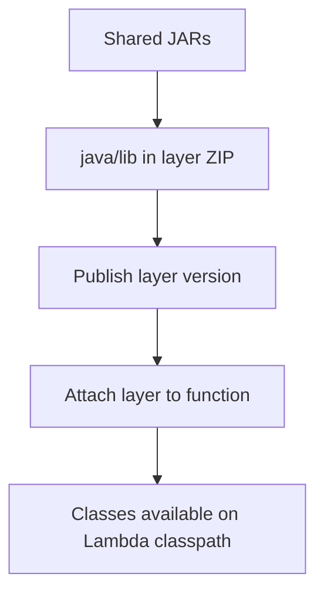

# Java Recipe: Lambda Layers for Shared JARs

Use layers when multiple Java functions share the same JAR files, SDK wrappers, or internal utility libraries.
Layers help centralize shared content, but they also add version coordination, so use them deliberately.

## Layer Layout



## Required Directory Structure

For Java layers, package JARs under `java/lib/`.

```text
layer/
└── java/
    └── lib/
        ├── shared-utils.jar
        └── other-library.jar
```

## Build the Layer ZIP

```bash
mkdir --parents "layer/java/lib"
cp target/shared-utils.jar "layer/java/lib/"
zip --recurse-paths java-layer.zip "layer"
```

## Publish the Layer

```bash
aws lambda publish-layer-version \
  --layer-name "java-shared-utils" \
  --description "Shared Java libraries for Lambda functions" \
  --zip-file "fileb://java-layer.zip" \
  --compatible-runtimes "java21" "java17" "java11"
```

## Reference the Layer in SAM

```yaml
Resources:
  SharedUtilsLayer:
    Type: AWS::Serverless::LayerVersion
    Properties:
      LayerName: java-shared-utils
      ContentUri: layer/
      CompatibleRuntimes:
        - java21

  OrdersFunction:
    Type: AWS::Serverless::Function
    Properties:
      Runtime: java21
      Handler: com.example.lambda.Handler::handleRequest
      CodeUri: .
      Layers:
        - !Ref SharedUtilsLayer
```

## When Layers Make Sense

- Several functions share the same internal Java library.
- You want separate versioning for shared code and function code.
- The dependency set is stable and reused broadly.

## When Layers Add Friction

- Only one function uses the code.
- The dependency changes almost every deploy.
- Operational simplicity matters more than reuse.

## Classpath Behavior

Lambda adds the Java layer content to the classpath automatically when it is packaged in the required `java/lib` structure.
Your function code can then import classes from the shared JAR as usual.

!!! tip
    Keep layers focused on truly shared code.
    If every deployment updates the layer and the function together, a single shaded JAR is often simpler.

## Verification

- The layer ZIP contains `java/lib/*.jar`.
- The published layer version is compatible with the function runtime.
- The function starts and imports shared classes without `ClassNotFoundException`.

## See Also

- [Java Runtime Reference](../java-runtime.md)
- [Infrastructure as Code for Java Lambda](../05-infrastructure-as-code.md)
- [Docker Image Recipe](./docker-image.md)
- [Java Recipes](./index.md)

## Sources

- [Working with Lambda layers for Java](https://docs.aws.amazon.com/lambda/latest/dg/java-layers.html)
- [Managing Lambda layers](https://docs.aws.amazon.com/lambda/latest/dg/chapter-layers.html)
