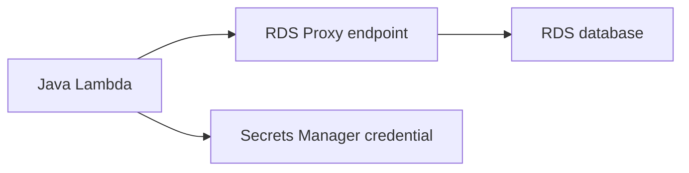

# Java Recipe: RDS Proxy with JDBC

Use this pattern when Lambda functions connect to an RDS database and you need more predictable connection management.
RDS Proxy sits between Lambda and the database so bursts of concurrent invocations do not overwhelm direct database connections.

## Connection Flow



## Maven Dependencies

```xml
<dependency>
    <groupId>software.amazon.awssdk</groupId>
    <artifactId>secretsmanager</artifactId>
    <version>2.30.35</version>
</dependency>
<dependency>
    <groupId>com.mysql</groupId>
    <artifactId>mysql-connector-j</artifactId>
    <version>9.2.0</version>
</dependency>
```

## Handler Example

```java
package com.example.lambda;

import com.amazonaws.services.lambda.runtime.Context;
import com.amazonaws.services.lambda.runtime.RequestHandler;
import java.sql.Connection;
import java.sql.DriverManager;
import java.sql.ResultSet;
import java.sql.Statement;
import java.util.Map;

public class RdsProxyHandler implements RequestHandler<Map<String, String>, Map<String, Object>> {
    @Override
    public Map<String, Object> handleRequest(Map<String, String> event, Context context) {
        String jdbcUrl = System.getenv("JDBC_URL");
        String username = System.getenv("DB_USERNAME");
        String password = System.getenv("DB_PASSWORD");

        try (Connection connection = DriverManager.getConnection(jdbcUrl, username, password);
             Statement statement = connection.createStatement();
             ResultSet resultSet = statement.executeQuery("SELECT 1")) {
            resultSet.next();
            return Map.of("dbCheck", resultSet.getInt(1));
        } catch (Exception ex) {
            throw new RuntimeException("Database call failed", ex);
        }
    }
}
```

## SAM Template Snippet

```yaml
Resources:
  RdsProxyFunction:
    Type: AWS::Serverless::Function
    Properties:
      Runtime: java21
      Handler: com.example.lambda.RdsProxyHandler::handleRequest
      CodeUri: .
      VpcConfig:
        SecurityGroupIds:
          - sg-xxxxxxxx
        SubnetIds:
          - subnet-xxxxxxxx
          - subnet-yyyyyyyy
      Environment:
        Variables:
          JDBC_URL: jdbc:mysql://orders-proxy.proxy-abcdefghijkl.$REGION.rds.amazonaws.com:3306/orders
          DB_USERNAME: app_user
          DB_PASSWORD: '{{resolve:secretsmanager:prod/orders/db:SecretString:password}}'
```

## Why RDS Proxy Helps

- Pools and manages database connections for bursty Lambda traffic.
- Reduces direct connection pressure on the database.
- Integrates with Secrets Manager for credential management.

## Operational Notes

- The function must run in the VPC that can reach the proxy endpoint.
- Security groups must allow function-to-proxy traffic.
- Keep query duration low because Lambda concurrency can still amplify database work.

!!! note
    The RDS Proxy endpoint, not the DB instance endpoint, belongs in the JDBC URL.
    That is the key control point for connection reuse and throttling.

## Verification

- Lambda can resolve and reach the proxy hostname.
- Security groups and subnets allow traffic.
- A simple `SELECT 1` succeeds from the function.
- Database connection counts remain stable under parallel load.

## See Also

- [Secrets Manager Recipe](./secrets-manager.md)
- [Configuration for Java Lambda Functions](../03-configuration.md)
- [Layers Recipe](./layers.md)
- [Java Recipes](./index.md)

## Sources

- [Using Amazon RDS Proxy with Lambda](https://docs.aws.amazon.com/lambda/latest/dg/services-rds.html)
- [Amazon RDS Proxy concepts](https://docs.aws.amazon.com/AmazonRDS/latest/UserGuide/rds-proxy.html)
