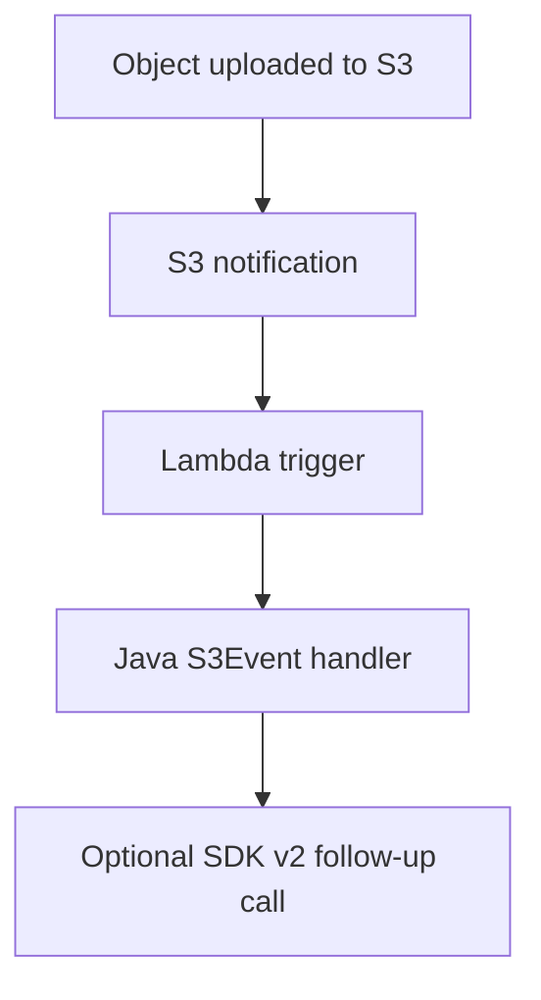

# Java Recipe: S3 Event

Use this pattern when object uploads, deletes, or lifecycle actions in Amazon S3 should trigger Lambda processing.
The handler consumes `S3Event` records and extracts bucket and object metadata directly from the event payload.

## Event Flow



## Maven Dependencies

```xml
<dependency>
    <groupId>com.amazonaws</groupId>
    <artifactId>aws-lambda-java-events</artifactId>
    <version>3.14.0</version>
</dependency>
<dependency>
    <groupId>software.amazon.awssdk</groupId>
    <artifactId>s3</artifactId>
    <version>2.30.35</version>
</dependency>
```

## Handler Example

```java
package com.example.lambda;

import com.amazonaws.services.lambda.runtime.Context;
import com.amazonaws.services.lambda.runtime.RequestHandler;
import com.amazonaws.services.lambda.runtime.events.S3Event;
import software.amazon.awssdk.services.s3.S3Client;
import software.amazon.awssdk.services.s3.model.HeadObjectRequest;

public class S3Handler implements RequestHandler<S3Event, Void> {
    private final S3Client s3Client = S3Client.builder().build();

    @Override
    public Void handleRequest(S3Event event, Context context) {
        event.getRecords().forEach(record -> {
            String bucket = record.getS3().getBucket().getName();
            String key = record.getS3().getObject().getKey();

            s3Client.headObject(HeadObjectRequest.builder().bucket(bucket).key(key).build());
            context.getLogger().log("Processed s3://" + bucket + "/" + key);
        });
        return null;
    }
}
```

## SAM Template Snippet

```yaml
Resources:
  S3ProcessorFunction:
    Type: AWS::Serverless::Function
    Properties:
      Runtime: java21
      Handler: com.example.lambda.S3Handler::handleRequest
      CodeUri: .
      Policies:
        - S3ReadPolicy:
            BucketName: uploads-bucket
      Events:
        UploadEvent:
          Type: S3
          Properties:
            Bucket: uploads-bucket
            Events:
              - s3:ObjectCreated:*
```

## Practical Notes

- S3 keys in events can be URL encoded.
- Notifications are asynchronous and can be retried.
- Multiple records can arrive in one event.
- Avoid writing back to the same prefix without loop prevention logic.

## Typical Use Cases

- Image thumbnail generation.
- Metadata extraction.
- File validation or classification.
- Triggering downstream workflows after object creation.

!!! warning
    If the function writes new objects into the same bucket and matching prefix, it can trigger itself again.
    Use separate prefixes or explicit filters to avoid recursive invocation loops.

## Verification

- Upload a test object to the configured bucket.
- Confirm that the event reaches the function.
- Validate that the logs show the expected bucket and key.
- Confirm any downstream S3 SDK operations succeed.

## See Also

- [Secrets Manager Recipe](./secrets-manager.md)
- [Layers Recipe](./layers.md)
- [Logging and Monitoring for Java Lambda](../04-logging-monitoring.md)
- [Java Recipes](./index.md)

## Sources

- [Using Lambda with Amazon S3](https://docs.aws.amazon.com/lambda/latest/dg/with-s3.html)
- [Processing Amazon S3 event notifications with Lambda](https://docs.aws.amazon.com/AmazonS3/latest/userguide/notification-content-structure.html)
