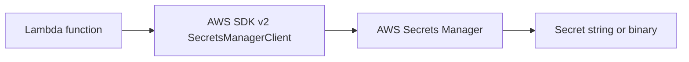

# Java Recipe: Secrets Manager

Use this pattern when a Java Lambda function needs a database password, API token, or other rotating credential at runtime.
The example uses `SecretsManagerClient` from AWS SDK v2 and keeps the secret lookup outside the request path when practical.

## Secret Retrieval Flow



## Maven Dependency

```xml
<dependency>
    <groupId>software.amazon.awssdk</groupId>
    <artifactId>secretsmanager</artifactId>
    <version>2.30.35</version>
</dependency>
```

## Handler Example

```java
package com.example.lambda;

import com.amazonaws.services.lambda.runtime.Context;
import com.amazonaws.services.lambda.runtime.RequestHandler;
import java.util.Map;
import software.amazon.awssdk.services.secretsmanager.SecretsManagerClient;
import software.amazon.awssdk.services.secretsmanager.model.GetSecretValueRequest;

public class SecretReaderHandler implements RequestHandler<Map<String, String>, Map<String, Object>> {
    private final SecretsManagerClient secretsClient = SecretsManagerClient.builder().build();
    private final String secretName = System.getenv("DB_SECRET_NAME");

    @Override
    public Map<String, Object> handleRequest(Map<String, String> event, Context context) {
        String secret = secretsClient.getSecretValue(GetSecretValueRequest.builder().secretId(secretName).build()).secretString();
        return Map.of("secretLoaded", secret != null, "requestId", context.getAwsRequestId());
    }
}
```

## SAM Template Snippet

```yaml
Resources:
  SecretReaderFunction:
    Type: AWS::Serverless::Function
    Properties:
      Runtime: java21
      Handler: com.example.lambda.SecretReaderHandler::handleRequest
      CodeUri: .
      Environment:
        Variables:
          DB_SECRET_NAME: prod/orders/db
      Policies:
        - Statement:
            - Effect: Allow
              Action:
                - secretsmanager:GetSecretValue
              Resource: arn:aws:secretsmanager:$REGION:<account-id>:secret:prod/orders/db-*
```

## Secret Caching Guidance

- Cache secrets between invocations when the function container is reused.
- Refresh the cache according to rotation frequency and failure handling requirements.
- Keep the secret name in an environment variable so you can swap secret references without code changes.

## Security Guidance

- Scope IAM access to the specific secret ARN.
- Do not write secret values to logs.
- Prefer Secrets Manager over plain environment variables for rotating credentials.

!!! warning
    If you enable SnapStart, validate how cached secrets should behave after restore.
    Re-fetch or refresh sensitive values when the security model requires it.

## Verification

- The function role can call `secretsmanager:GetSecretValue`.
- The configured secret name exists.
- The function returns success without logging secret material.

## See Also

- [Configuration for Java Lambda Functions](../03-configuration.md)
- [RDS Proxy Recipe](./rds-proxy.md)
- [Logging and Monitoring for Java Lambda](../04-logging-monitoring.md)
- [Java Recipes](./index.md)

## Sources

- [Use AWS Secrets Manager secrets in Lambda functions](https://docs.aws.amazon.com/lambda/latest/dg/with-secrets-manager.html)
- [AWS SDK for Java 2.x Secrets Manager examples](https://docs.aws.amazon.com/sdk-for-java/latest/developer-guide/java_secrets-manager_code_examples.html)
