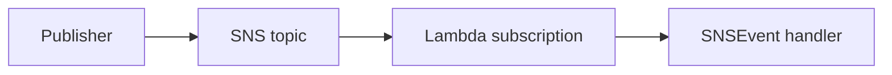

# Java Recipe: SNS Trigger

Use this pattern when Amazon SNS fans out notifications to Lambda subscribers.
The handler consumes `SNSEvent` and processes each message independently inside the batch.

## Delivery Flow



## Maven Dependency

```xml
<dependency>
    <groupId>com.amazonaws</groupId>
    <artifactId>aws-lambda-java-events</artifactId>
    <version>3.14.0</version>
</dependency>
```

## Handler Example

```java
package com.example.lambda;

import com.amazonaws.services.lambda.runtime.Context;
import com.amazonaws.services.lambda.runtime.RequestHandler;
import com.amazonaws.services.lambda.runtime.events.SNSEvent;

public class SnsHandler implements RequestHandler<SNSEvent, Void> {
    @Override
    public Void handleRequest(SNSEvent event, Context context) {
        for (SNSEvent.SNSRecord record : event.getRecords()) {
            String subject = record.getSNS().getSubject();
            String message = record.getSNS().getMessage();
            context.getLogger().log("subject=" + subject + ", message=" + message);
        }
        return null;
    }
}
```

## SAM Template Snippet

```yaml
Resources:
  TopicConsumerFunction:
    Type: AWS::Serverless::Function
    Properties:
      Runtime: java21
      Handler: com.example.lambda.SnsHandler::handleRequest
      CodeUri: .
      Events:
        TopicEvent:
          Type: SNS
          Properties:
            Topic: arn:aws:sns:$REGION:<account-id>:orders-topic
```

## When SNS Fits Well

- One published event should reach multiple subscribers.
- Subscribers are independent and loosely coupled.
- Lambda should process notifications asynchronously.

## Message Design Tips

- Keep a stable JSON schema inside the SNS message body.
- Include event type and version fields for evolution.
- Avoid sending oversized payloads; keep within SNS message limits.

!!! note
    SNS wraps your application message inside an SNS envelope.
    Your handler usually reads the actual business payload from `record.getSNS().getMessage()`.

## Verification

- Publish a test message to the SNS topic.
- Confirm the Lambda subscription is invoked.
- Check CloudWatch Logs for the SNS subject and message.

## See Also

- [SQS Trigger Recipe](./sqs-trigger.md)
- [S3 Event Recipe](./s3-event.md)
- [Logging and Monitoring for Java Lambda](../04-logging-monitoring.md)
- [Java Recipes](./index.md)

## Sources

- [Using Lambda with Amazon SNS](https://docs.aws.amazon.com/lambda/latest/dg/with-sns.html)
- [Amazon SNS message format](https://docs.aws.amazon.com/sns/latest/dg/sns-message-and-json-formats.html)
