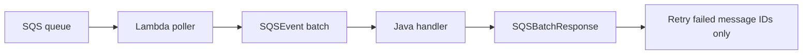

# Java Recipe: SQS Trigger with Batch Item Failures

Use this pattern when Lambda polls Amazon SQS and your handler must report partial batch failures.
The handler consumes `SQSEvent` and returns `SQSBatchResponse` so successfully processed messages are not retried.

## Batch Processing Flow



## Maven Dependency

```xml
<dependency>
    <groupId>com.amazonaws</groupId>
    <artifactId>aws-lambda-java-events</artifactId>
    <version>3.14.0</version>
</dependency>
```

## Handler Example

```java
package com.example.lambda;

import com.amazonaws.services.lambda.runtime.Context;
import com.amazonaws.services.lambda.runtime.RequestHandler;
import com.amazonaws.services.lambda.runtime.events.SQSEvent;
import com.amazonaws.services.lambda.runtime.events.SQSBatchResponse;
import java.util.ArrayList;
import java.util.List;

public class QueueHandler implements RequestHandler<SQSEvent, SQSBatchResponse> {
    @Override
    public SQSBatchResponse handleRequest(SQSEvent event, Context context) {
        List<SQSBatchResponse.BatchItemFailure> failures = new ArrayList<>();

        for (SQSEvent.SQSMessage message : event.getRecords()) {
            try {
                process(message);
            } catch (RuntimeException ex) {
                context.getLogger().log("Failed messageId=" + message.getMessageId());
                failures.add(new SQSBatchResponse.BatchItemFailure(message.getMessageId()));
            }
        }

        return new SQSBatchResponse(failures);
    }

    private void process(SQSEvent.SQSMessage message) {
        if (message.getBody().contains("fail")) {
            throw new IllegalStateException("Simulated failure");
        }
    }
}
```

## SAM Template Snippet

```yaml
Resources:
  QueueConsumerFunction:
    Type: AWS::Serverless::Function
    Properties:
      Runtime: java21
      Handler: com.example.lambda.QueueHandler::handleRequest
      CodeUri: .
      Events:
        OrdersQueue:
          Type: SQS
          Properties:
            Queue: arn:aws:sqs:$REGION:<account-id>:orders-queue
            BatchSize: 10
            FunctionResponseTypes:
              - ReportBatchItemFailures
```

## Why Partial Batch Response Matters

Without `ReportBatchItemFailures`, one failing message can cause the whole batch to return for retry.
With partial batch response enabled, only failed message IDs are retried.

## Operational Practices

- Keep handlers idempotent because retries still happen.
- Configure a dead-letter queue or redrive policy.
- Monitor queue depth, age of oldest message, and Lambda errors.
- Keep batch size aligned with processing time and visibility timeout.

!!! tip
    Set the SQS visibility timeout longer than the Lambda timeout plus retry overhead.
    That helps prevent messages from becoming visible again while the function is still processing them.

## Verification

- Send a mix of successful and failing messages.
- Confirm that only failed message IDs are retried.
- Verify successful messages are not processed again.

## See Also

- [SNS Trigger Recipe](./sns-trigger.md)
- [Custom Metrics Recipe](./custom-metrics.md)
- [Logging and Monitoring for Java Lambda](../04-logging-monitoring.md)
- [Java Recipes](./index.md)

## Sources

- [Using Lambda with Amazon SQS](https://docs.aws.amazon.com/lambda/latest/dg/with-sqs.html)
- [Reporting batch item failures for Lambda and SQS](https://docs.aws.amazon.com/lambda/latest/dg/services-sqs-errorhandling.html)
