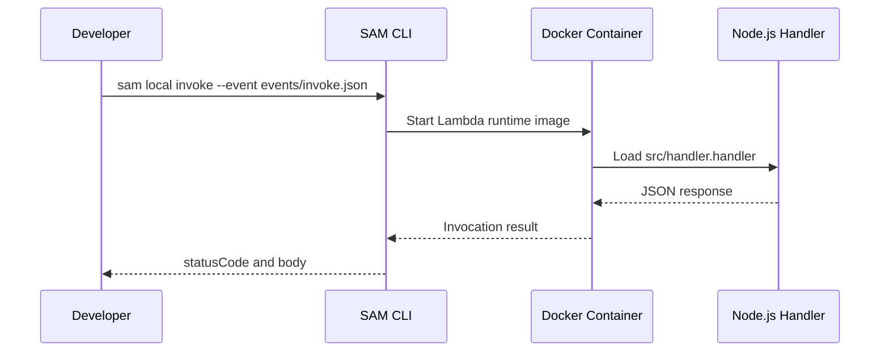

# Run a Node.js Lambda Function Locally

This tutorial shows how to run and test a Node.js Lambda function locally with the AWS SAM CLI before you deploy to AWS.
Use `sam local invoke` for one-off events and `sam local start-api` for API Gateway-compatible handlers.

## Prerequisites

- Node.js 20 or later installed.
- AWS SAM CLI installed.
- Docker running locally.
- A working folder with `package.json` and `template.yaml`.

## What You Will Build

You will create a minimal API-style Lambda handler and test it with both direct event payloads and a local HTTP endpoint.

```text
.
├── src/
│   └── handler.mjs
├── events/
│   ├── invoke.json
│   └── apigw-v2.json
├── template.yaml
└── package.json
```

## Create the Handler

`src/handler.mjs`

```javascript
export const handler = async (event) => {
    const name = event?.queryStringParameters?.name ?? event?.name ?? "world";

    return {
        statusCode: 200,
        headers: { "content-type": "application/json" },
        body: JSON.stringify({
            message: `hello ${name}`,
            runtime: process.version,
        }),
    };
};
```

`template.yaml`

```yaml
AWSTemplateFormatVersion: "2010-09-09"
Transform: AWS::Serverless-2016-10-31
Resources:
  NodeLocalFunction:
    Type: AWS::Serverless::Function
    Properties:
      Runtime: nodejs20.x
      Handler: src/handler.handler
      CodeUri: .
      MemorySize: 256
      Timeout: 10
      Events:
        Api:
          Type: HttpApi
          Properties:
            Path: /hello
            Method: GET
```

`events/invoke.json`

```json
{
    "name": "lambda"
}
```

## Install Dependencies

If your function has dependencies, install them before local execution:

```bash
npm install
sam validate
```

## Invoke the Function Locally

Run a single event through the handler:

```bash
sam local invoke NodeLocalFunction --event events/invoke.json
```

Expected output pattern:

```json
{
    "statusCode": 200,
    "headers": {
        "content-type": "application/json"
    },
    "body": "{\"message\":\"hello lambda\",\"runtime\":\"v20.x\"}"
}
```

## Start a Local API

Expose the same function through a local HTTP endpoint:

```bash
sam local start-api --port 3000
```

Then test it:

```bash
curl "http://127.0.0.1:3000/hello?name=sam"
```

Expected response body:

```json
{"message":"hello sam","runtime":"v20.x"}
```



## Local API Event Shape Notes

- `sam local invoke` sends the exact file content you provide.
- `sam local start-api` generates API Gateway event objects.
- HTTP API payload format 2.0 includes `rawPath`, `requestContext`, and `queryStringParameters`.

## Troubleshooting Tips

!!! note
    If `sam local invoke` fails before your code runs, confirm Docker is running and the function resource logical ID matches the template.

!!! note
    If module resolution fails, verify `CodeUri`, `Handler`, and the exported symbol name all line up with the on-disk file structure.

## Verification

Run these checks:

```bash
sam validate
sam local invoke NodeLocalFunction --event events/invoke.json
sam local start-api --port 3000
```

Success looks like:

- Template validation passes.
- Local invocation returns HTTP 200.
- The local endpoint responds on `127.0.0.1:3000`.

## See Also

- [Deploy Your First Node.js Lambda Function](./02-first-deploy.md)
- [Node.js Runtime Reference](./nodejs-runtime.md)
- [API Gateway HTTP API Recipe](./recipes/api-gateway-http.md)
- [Language Guide Overview](./index.md)

## Sources

- [Testing serverless applications locally with the AWS SAM CLI](https://docs.aws.amazon.com/serverless-application-model/latest/developerguide/using-sam-cli-local-testing.html)
- [sam local invoke](https://docs.aws.amazon.com/serverless-application-model/latest/developerguide/sam-cli-command-reference-sam-local-invoke.html)
- [sam local start-api](https://docs.aws.amazon.com/serverless-application-model/latest/developerguide/sam-cli-command-reference-sam-local-start-api.html)
- [Building Lambda functions with Node.js](https://docs.aws.amazon.com/lambda/latest/dg/lambda-nodejs.html)
